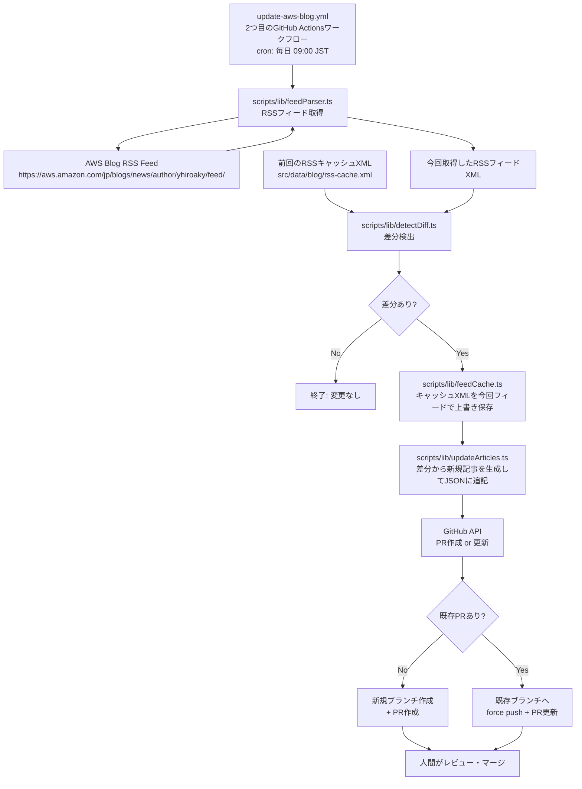
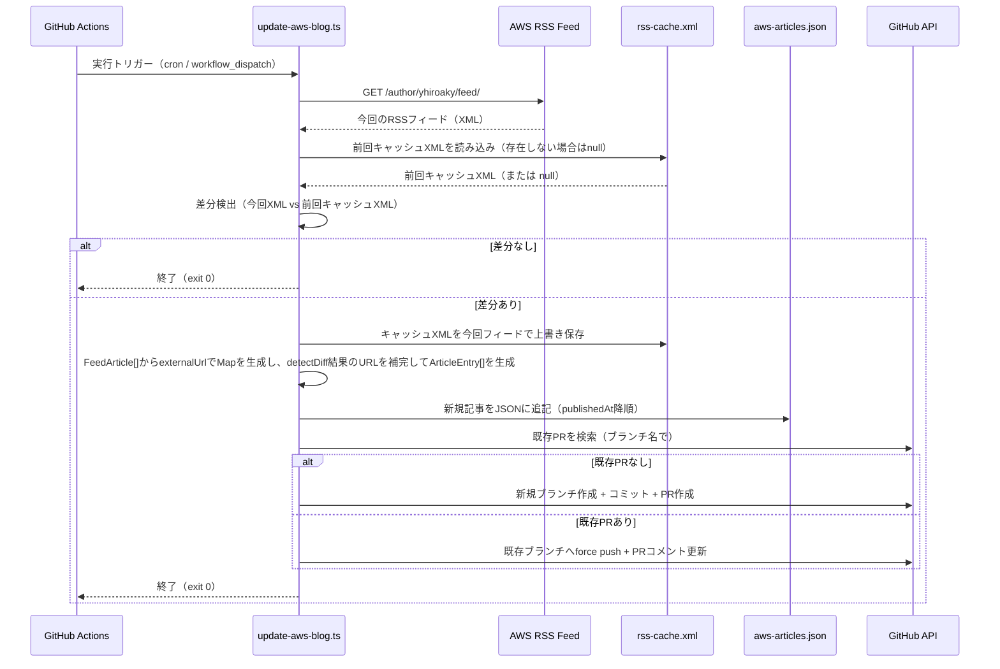

# 設計ドキュメント: aws-blog-auto-update

## 概要

本フィーチャーは、既存の `deploy.yml`（GitHub Pagesデプロイ用）に続く、リポジトリ2つ目のGitHub Actionsワークフロー（`.github/workflows/update-aws-blog.yml`）として実装する。

GitHub Actions を使って `https://aws.amazon.com/jp/blogs/news/author/yhiroaky/` のRSSフィードを定期取得し、前回保存したRSSフィードXMLキャッシュ（`src/data/blog/rss-cache.xml`）との差分を検出して自動的にPRを作成・更新する仕組みを構築する。人間がPRをレビュー・マージすることで、ブログリストが更新される。

このフィーチャーにより、手動でJSONを編集する作業が不要になり、新しいブログ記事が公開されると自動的にポートフォリオサイトへの反映候補が生成される。差分検出はXMLレベルで行うため、JSONの構造変更に依存しない安定した比較が可能となる。

## アーキテクチャ



## シーケンス図

### 新規PR作成フロー



## コンポーネントとインターフェース

### Component 1: RSSフィードパーサー (`scripts/lib/feedParser.ts`)

**目的**: AWS BlogのRSSフィードを取得・パースし、記事データに正規化する

**インターフェース**:
```typescript
export interface FeedArticle {
  id: string;          // URLから生成したスラッグ
  externalUrl: string; // 記事URL
  publishedAt: string; // ISO 8601形式（例: "2025-07-01"）
}

/**
 * RSSフィードURLを取得してパースし、記事リストを返す
 * @param feedUrl - RSSフィードのURL
 * @returns 記事リスト（publishedAt降順）
 */
export async function parseFeed(feedUrl: string): Promise<FeedArticle[]>

/**
 * 記事URLからIDスラッグを生成する
 * 例: "https://aws.amazon.com/jp/blogs/news/my-article/" → "my-article"
 */
export function extractIdFromUrl(url: string): string
```

**責務**:
- RSSフィード（XML）のfetch
- `fast-xml-parser` を使用してXMLをパース
- `<item>` 要素から `<link>`, `<pubDate>` を抽出
- `pubDate` をISO 8601日付文字列（`YYYY-MM-DD`）に変換
- URLからIDスラッグを生成
- publishedAt降順でソート

---

### Component 2: 差分検出 (`scripts/lib/detectDiff.ts`)

**目的**: 今回取得したRSSフィードXMLと前回キャッシュXMLを比較し、新規記事を特定する

**インターフェース**:
```typescript
export interface ArticleEntry {
  id: string;
  externalUrl: string;
  publishedAt?: string;
}

export interface DiffResult {
  newArticles: ArticleEntry[];  // 新規追加すべき記事
  hasChanges: boolean;
}

/**
 * 今回取得したRSSフィードXMLと前回キャッシュXMLを比較して差分を返す
 * @param currentFeedXml - 今回取得したRSSフィードのXML文字列
 * @param previousFeedXml - 前回保存したキャッシュXMLの文字列（初回はnull）
 * @returns 差分結果
 */
export function detectDiff(
  currentFeedXml: string,
  previousFeedXml: string | null
): DiffResult
```

**責務**:
- XML内の `<link>` 要素のセットを比較して差分を検出
- `previousFeedXml` が `null`（初回実行）の場合は全記事を新規として扱う
- 今回XMLに存在し前回XMLに存在しない `<link>` を `newArticles` として返す
- `hasChanges` フラグで差分有無を通知

---

### Component 3: RSSキャッシュ管理 (`scripts/lib/feedCache.ts`)

**目的**: RSSフィードXMLのキャッシュファイルの読み書きを管理する

**インターフェース**:
```typescript
/**
 * 前回のRSSフィードXMLキャッシュを読み込む
 * @param cachePath - キャッシュファイルのパス
 * @returns キャッシュXML文字列（存在しない場合はnull）
 */
export function loadCache(cachePath: string): string | null

/**
 * 今回取得したRSSフィードXMLをキャッシュとして保存する
 * @param cachePath - キャッシュファイルのパス
 * @param xmlContent - 保存するXML文字列
 */
export function saveCache(cachePath: string, xmlContent: string): void
```

**責務**:
- キャッシュファイルが存在しない場合（初回実行）は `null` を返す
- キャッシュファイルが壊れている・読み取り不能な場合は `null` を返してログ出力
- 差分ありの場合のみ `saveCache` を呼び出してキャッシュを上書き更新

---

### Component 4: JSONアップデーター (`scripts/lib/updateArticles.ts`)

**目的**: 差分結果を既存JSONにマージし、ソート済みの新しいJSONを生成する

**インターフェース**:
```typescript
/**
 * 既存記事リストに新規記事を追加し、publishedAt降順でソートして返す
 * @param existing - 現在の記事リスト
 * @param newArticles - 追加する新規記事リスト
 * @returns マージ・ソート済みの記事リスト
 */
export function mergeAndSort(
  existing: ArticleEntry[],
  newArticles: ArticleEntry[]
): ArticleEntry[]
```

**責務**:
- 新規記事を既存リストの先頭に追加
- `publishedAt` 降順でソート（`publishedAt` がない場合は末尾）
- 重複排除（`externalUrl` ベース）

---

### Component 5: GitHub Actionsワークフロー (`.github/workflows/update-aws-blog.yml`)

**目的**: スケジュール実行とPR作成・更新のオーケストレーション

**責務**:
- リポジトリ内の2つ目のワークフロー（既存: `deploy.yml`、本ワークフロー: `update-aws-blog.yml`）
- cron スケジュール（毎日 00:00 UTC = 09:00 JST）でトリガー
- `workflow_dispatch` による手動実行サポート
- 既存の `deploy.yml` と同様に `actions/setup-node@v4` + `.nvmrc` でNode.jsバージョンを統一
- `npm ci` で依存関係をインストール（`fast-xml-parser`, `tsx` を含む）
- `tsx scripts/update-aws-blog.ts` でスクリプトを実行
- `gh` CLI は `ubuntu-latest` に標準搭載のため追加インストール不要
- `GITHUB_TOKEN` は GitHub Actions が自動提供するため、シークレット設定不要

---

### Component 6: エントリーポイントスクリプト (`scripts/update-aws-blog.ts`)

**目的**: 上記コンポーネントを組み合わせてワークフロー全体を実行する

**責務**:
- フィード取得 → 差分検出 → `ArticleEntry` 生成 → JSON更新 → PR作成/更新 の一連の処理を実行
- 差分なしの場合は早期終了
- エラー時は非ゼロ終了コードで終了

**`ArticleEntry` 生成フロー（`detectDiff` 結果の補完）**:

`detectDiff` が返す `newArticles` は `id: ''`・`publishedAt: undefined` の不完全な `ArticleEntry` である。
エントリーポイントは `parseFeed` の結果（`FeedArticle[]`）を使って以下の手順で補完する:

```typescript
// parseFeed の結果を externalUrl でインデックス化
const feedMap = new Map(feedArticles.map(a => [a.externalUrl, a]));

// detectDiff の結果を完全な ArticleEntry に変換
const completeEntries: ArticleEntry[] = diff.newArticles.map(({ externalUrl }) => {
  const feed = feedMap.get(externalUrl);
  return feed
    ? { id: feed.id, externalUrl, publishedAt: feed.publishedAt }
    : { id: extractIdFromUrl(externalUrl), externalUrl }; // parseFeed に存在しない場合のフォールバック
});
```

- `parseFeed` の結果に存在するURLは `id` と `publishedAt` をそのまま使用する
- `parseFeed` の結果に存在しないURLは `extractIdFromUrl` でスラッグを生成し、`publishedAt` は省略する
- 補完後の `completeEntries` を `mergeAndSort` に渡す（`mergeAndSort` のシグネチャ変更は不要）

## データモデル

### aws-articles.json エントリー

```typescript
interface ArticleEntry {
  id: string;          // URLスラッグ（例: "my-article-title"）
  externalUrl: string; // 完全なURL（例: "https://aws.amazon.com/jp/blogs/news/my-article-title/"）
  publishedAt?: string; // ISO 8601日付（例: "2025-07-01"）省略可
}
```

**バリデーションルール**:
- `id`: 非空文字列、URLスラッグ形式（英数字・ハイフン）
- `externalUrl`: 有効なURL、`https://aws.amazon.com/jp/blogs/news/` プレフィックス
- `publishedAt`: `YYYY-MM-DD` 形式、省略可

### RSSキャッシュファイル (`src/data/blog/rss-cache.xml`)

| 項目 | 内容 |
|---|---|
| パス | `src/data/blog/rss-cache.xml` |
| 内容 | 前回取得したRSSフィードXMLをそのまま保存 |
| 初回実行時 | ファイルが存在しない → `loadCache` が `null` を返す → 全記事を新規として扱う |
| 更新タイミング | 差分ありの場合のみ、今回取得したXMLで上書き |
| Git管理 | `.gitignore` には追加しない（変更履歴として残す） |

### RSSフィード `<item>` 要素のマッピング

| RSSフィールド | JSONフィールド | 変換処理 |
|---|---|---|
| `<link>` | `externalUrl` | そのまま使用 |
| `<link>` | `id` | URLの末尾パスセグメントを抽出 |
| `<pubDate>` | `publishedAt` | RFC 2822 → `YYYY-MM-DD` 変換 |

### PRブランチ命名規則

```
chore/update-aws-blog-{YYYY-MM-DD}
```

例: `chore/update-aws-blog-2025-07-01`

既存PRの検索は、このブランチ名プレフィックス `chore/update-aws-blog-` で行う。

## エラーハンドリング

### エラーシナリオ 1: RSSフィード取得失敗

**条件**: ネットワークエラー、タイムアウト、非200レスポンス  
**対応**: エラーログを出力し、非ゼロ終了コードでワークフローを失敗させる  
**復旧**: GitHub Actionsの再実行、または `workflow_dispatch` で手動トリガー

### エラーシナリオ 2: XMLパースエラー

**条件**: フィードのXML形式が不正、または予期しない構造変更  
**対応**: エラーログに詳細を出力し、処理を中断  
**復旧**: フィードURLの確認、パーサーロジックの修正

### エラーシナリオ 3: GitHub API操作失敗

**条件**: `GITHUB_TOKEN` の権限不足、レート制限  
**対応**: エラーログを出力し、非ゼロ終了コードで終了  
**復旧**: トークン権限の確認（`contents: write`, `pull-requests: write` が必要）

### エラーシナリオ 4: IDの重複

**条件**: 異なるURLが同じスラッグを生成する  
**対応**: `externalUrl` を正規のキーとして使用し、IDは参考値として扱う。重複時はURLハッシュを付与  
**復旧**: `extractIdFromUrl` のロジック調整

### エラーシナリオ 5: キャッシュファイルの破損

**条件**: `rss-cache.xml` が不正なXML・空ファイル・読み取り不能な状態  
**対応**: `loadCache` が `null` を返し、初回実行と同様に全記事を新規として扱う。警告ログを出力  
**復旧**: 次回実行時に正常なキャッシュが上書き保存されるため、自動復旧する

## テスト戦略

### ユニットテスト（`src/tests/`）

`src/lib/` の各ユーティリティに対応するテストを作成する。

| テストファイル | テスト対象 | 主なテストケース |
|---|---|---|
| `scripts/lib/__tests__/feedParser.test.ts` | `parseFeed`, `extractIdFromUrl` | 正常パース、`pubDate`変換、不正XML、空フィード |
| `scripts/lib/__tests__/detectDiff.test.ts` | `detectDiff` | 今回XML vs 前回XMLで新規記事あり、差分なし、初回実行（キャッシュなし・全件新規）、空フィード |
| `scripts/lib/__tests__/feedCache.test.ts` | `loadCache`, `saveCache` | 正常読み込み、ファイル未存在時のnull返却、破損ファイル時のnull返却、正常保存 |
| `scripts/lib/__tests__/updateArticles.test.ts` | `mergeAndSort` | ソート順、重複排除、`publishedAt`なし記事の扱い |

### プロパティベーステスト

- `detectDiff` の冪等性: 同じXMLを `currentFeedXml` と `previousFeedXml` に渡すと差分が出ないこと
- `detectDiff` の初回実行: `previousFeedXml` が `null` の場合、今回XMLの全 `<link>` が `newArticles` に含まれること
- `mergeAndSort` のソート安定性: `publishedAt` 降順が常に保たれること

### 統合テスト（手動）

- `workflow_dispatch` でワークフローを手動実行し、PRが正しく作成されることを確認
- 既存PRがある状態で再実行し、force pushで更新されることを確認

## セキュリティ考慮事項

- `GITHUB_TOKEN` は GitHub Actions が自動提供するトークンを使用（シークレット追加不要）
- ワークフローに必要な最小権限のみ付与: `contents: write`, `pull-requests: write`
- 外部フィードからのデータはJSONに書き込む前にバリデーション（URL形式、日付形式）
- `git push` は自動実行しない（PRを作成して人間が承認）

## 依存関係

| 依存 | 用途 | 追加要否 |
|---|---|---|
| Node.js built-in `fetch` | RSSフィード取得 | 不要（Node 18+） |
| Node.js built-in `fs` | JSONファイル読み書き | 不要 |
| `fast-xml-parser` | RSSフィード（XML）のパース | 要追加（devDependencies） |
| `tsx` | TypeScriptスクリプト実行（GitHub Actions ベストプラクティス） | 要追加（devDependencies） |
| `gh` CLI | PR作成・更新 | GitHub Actions環境に標準搭載（追加不要） |
| Vitest | ユニットテスト | 既存 |

## 正確性プロパティ

*プロパティとは、システムの全ての有効な実行において成立すべき特性・振る舞いのこと。人間が読める仕様と機械検証可能な正確性保証の橋渡しとなる。*

### プロパティ 1: RSSフィードのパース結果ソート順

任意の有効なRSSフィードXMLに対して、FeedParserがパースした結果は常に `publishedAt` 降順でソートされている。

**Validates: Requirements 2.5**

### プロパティ 2: 日付変換の正確性

任意のRFC 2822形式の日付文字列に対して、FeedParserが変換した結果は `YYYY-MM-DD` 形式の正しい日付文字列である。

**Validates: Requirements 2.3, 8.2**

### プロパティ 3: IDスラッグの形式保証

任意の有効な記事URLに対して、FeedParserが生成するIDスラッグは英数字とハイフンのみで構成される非空文字列である。

**Validates: Requirements 2.4, 8.3**

### プロパティ 4: キャッシュのラウンドトリップ

任意のXML文字列に対して、CacheManagerで保存してから読み込むと、元のXML文字列と同一の内容が返される。

**Validates: Requirements 3.1, 3.4**

### プロパティ 5: 差分検出の正確性

任意の今回XMLと前回XMLのペアに対して、DiffDetectorが返す `newArticles` は「今回XMLに存在し前回XMLに存在しないURL」の集合と一致し、`hasChanges` はその集合が空でないことと等価である。

**Validates: Requirements 4.1, 4.4**

### プロパティ 6: 初回実行時の全件新規扱い

任意の有効なRSSフィードXMLに対して、前回キャッシュが `null` の場合、DiffDetectorが返す `newArticles` はそのXML内の全 `<link>` 要素を含む。

**Validates: Requirements 4.2**

### プロパティ 7: 差分なし時の冪等性

任意のRSSフィードXMLに対して、同じXMLを `currentFeedXml` と `previousFeedXml` の両方に渡すと、DiffDetectorは `hasChanges: false` を返す。

**Validates: Requirements 4.3**

### プロパティ 8: マージ後のソート安定性

任意の既存記事リストと新規記事リストに対して、ArticleUpdaterがマージした結果は常に `publishedAt` 降順でソートされており、`publishedAt` が存在しない記事はリストの末尾に配置される。

**Validates: Requirements 5.1, 5.3**

### プロパティ 9: 重複排除の保証

任意の記事リスト（重複する `externalUrl` を含む可能性がある）に対して、ArticleUpdaterがマージした結果には同じ `externalUrl` を持つエントリーが1件のみ存在する。

**Validates: Requirements 5.2**

### プロパティ 10: URLバリデーションの網羅性

任意の文字列に対して、FeedParserのURLバリデーションは `https://aws.amazon.com/jp/blogs/news/` プレフィックスを持つ有効なURLのみを受け入れ、それ以外を拒否する。

**Validates: Requirements 8.1**

### プロパティ 11: `ArticleEntry` 補完の完全性

`parseFeed` の結果（`FeedArticle[]`）と `detectDiff` の結果（`DiffResult`）が与えられた場合、EntryScriptが生成する `ArticleEntry[]` は以下を満たす:
- `parseFeed` の結果に存在するURLは `id` と `publishedAt` が補完されている
- `parseFeed` の結果に存在しないURLは `id` が非空文字列であり、`publishedAt` は省略されている
- 生成された全エントリーの `externalUrl` は `detectDiff` が返した `newArticles` のURLと一致する

**Validates: Requirements 5.4, 5.5**
