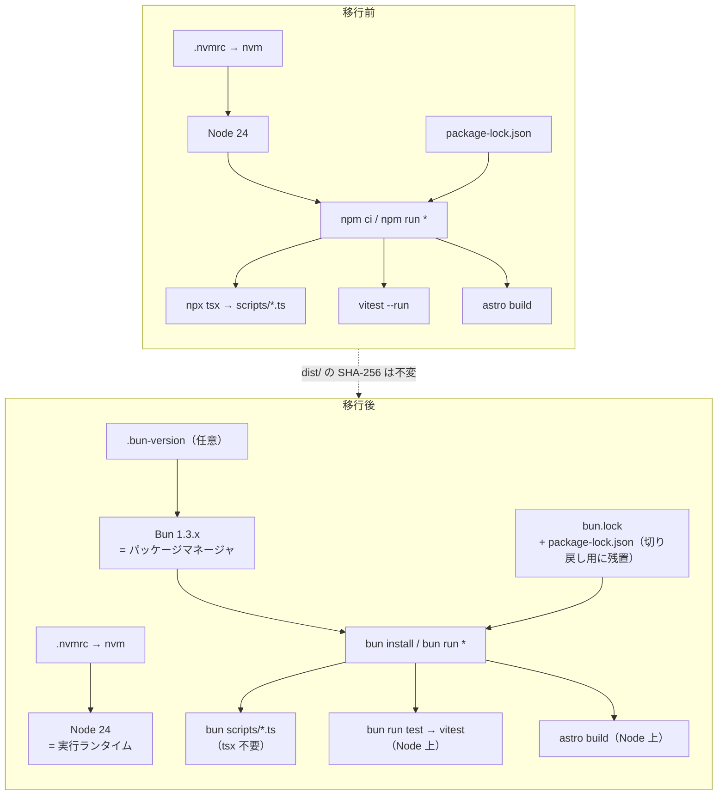
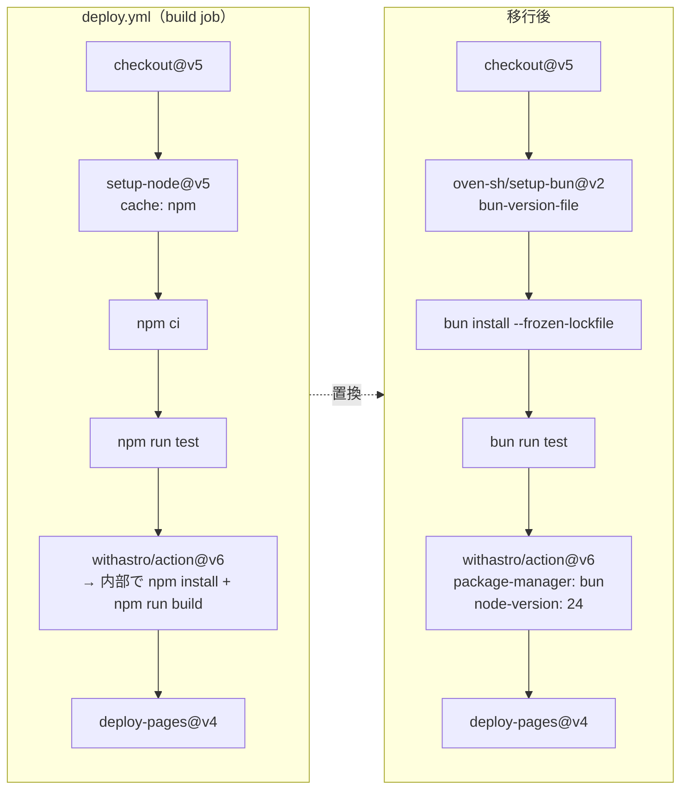

# Design Document: bun-migration

パッケージマネージャを npm から Bun に置き換える。実行ランタイムは Node のまま維持し、
段階移行 + 切り戻し可能な形で CI / ローカル開発の依存管理のみを Bun に寄せる。

出典: GitHub Discussion #67「調査: ランタイム/パッケージマネージャを Bun に置き換える場合の影響範囲と実測結果」
（https://github.com/yosse95ai/yosse95ai.github.io/discussions/67）

---

## Overview

GitHub Pages は静的配信のため、本番ランタイムは存在しない。したがって本移行の影響範囲は
**ビルド・CI・ローカル開発のみ**で、配信物への影響はゼロ。実測でも `dist/` 25 ファイルの
SHA-256 が Node ビルドと完全一致している（3 パターン検証済み）。

移行の目的は**高速化ではない**。実測での利得は install の 3〜4 秒短縮のみで、build / test は
ほぼ同等（±0〜0.9 秒）。本設計が採用する主目的は次の 2 点。

1. **npm lockfile バグからの構造的な脱出**（npm/cli#4828, #8320）。プラットフォーム固有
   `optionalDependencies` が lockfile に正しく記録されないバグ。本プロジェクトは該当パッケージを
   5 つ抱えている（`@tailwindcss/oxide` / `lightningcss` / `@rollup/rollup-*` / `sharp` / `esbuild`）。
   なかでも `esbuild` は `@esbuild/*` プラットフォーム固有パッケージを `optionalDependencies` として
   **26 個**宣言しており、該当パッケージの中で最も数が多い（`package-lock.json` で実測）。
   開発機 macOS ARM64 と CI Linux x64 でプラットフォームが異なるため、いつ踏んでもおかしくない。
   Bun は `cpu` / `os` を正規化して lockfile に保存し、無効なパッケージは実行時にスキップするため
   lockfile がプラットフォーム間で変化しない。
2. **`tsx` 依存の除去**。`bun scripts/refresh-ogp-cache.ts` が設定なしで動作（OGP 38/38 成功）。

### 実際に対応が必要なのは 3 点のみ

Discussion #67 に投稿された訂正コメント（`trustedDependencies` の footgun は本プロジェクトでは
実害なし。詳細は [R1](#-r1-trusteddependencies-の-footgun本構成では非該当)）により
懸念が 1 つ減り、移行で実際に手を入れる必要がある箇所は次の 3 点に絞られた。

1. **`scripts/update-aws-blog.ts:58` の `npx tsx` → `bun`**（Bun 単体環境で確実に壊れる）
2. **`withastro/action` の lockfile 検出順**（`package-manager: bun` の明示、または
   `package-lock.json` の削除。本設計は前者を採用）
3. **`actions/setup-node` → `oven-sh/setup-bun` への差し替え**（`cache: npm` の残存に注意）

「`bun run` はデフォルトで Node を使う」は仕様の理解であって対応事項ではない。CI キャッシュの
後退や Alpine/musl 非サポートは現構成では非該当ないし実害なし。

設計上の一貫した方針は「**Bun はパッケージマネージャとしてのみ使う。ランタイムは Node**」。
`bunfig.toml` の `[run] bun = true` は設定せず、CI で `--bun` も付けない。テストランナーも
Vitest を維持し `bun test`（ネイティブランナー）へは移行しない。

---

## ワークスペース実地検証の結果（Discussion との差異）

設計前に実ファイルを読み、Discussion の記述と突き合わせた。差異は以下。

| 項目 | Discussion の記述 | 実際のワークスペース | 設計への影響 |
|---|---|---|---|
| `scripts/update-aws-blog.ts:58` の `npx tsx` | 58 行目 | **一致**（58 行目 `execSync('npx tsx scripts/refresh-ogp-cache.ts', ...)`） | なし |
| `deploy.yml` | `actions/setup-node@v5` / `withastro/action` | **一致**（`checkout@v5` + `setup-node@v5` + `cache: npm` + `npm ci` + `npm run test` + `withastro/action@v6`） | なし |
| `update-aws-blog.yml` | 「同上」 | `checkout@v4` + **`setup-node@v4`**（v5 ではない）+ `npm ci` + `npx tsx scripts/update-aws-blog.ts` | LLD で v4 前提の差分を記述 |
| `withastro/action` の lockfile 検出順 | 71 行 `package-lock.json` → 75 行 `bun.lock` | **v6 で一致**（71 行 / 75 行、79 行に `bun.lockb`） | なし |
| Bun 時も Setup Node が走る | action.yml 120-124 行 | **v6 では 121-124 行**（`Setup Node (Bun)`、`if: PACKAGE_MANAGER == 'bun'`） | なし（結論は同じ） |
| `motion` の未使用 | src / scripts で 0 箇所 | **一致**（grep 0 件。`doc/blueprint.md` の技術スタック表にのみ記載が残存） | Phase 0 で削除 |
| ローカル Bun バージョン | 実測 1.2.14 | **1.3.14 がインストール済み** | `packageManager` は実機の 1.3.x で固定する（後述） |
| `.nvmrc` | 24 | **一致**（`24`） | — |
| `node_modules` | — | **空**（未インストール状態）。`npm run test` は `vitest: command not found` | 移行前ベースライン取得のため一度 `npm ci` が必要 |
| テスト数 86 | 86 tests / 9 files | **テストファイルは 9 件で一致**（`src/tests/` 4 + `scripts/lib/__tests__/` 5）。件数はローカル未検証 | ベースラインを Phase 0 で実測して確定 |

### 新規に判明した重要事実（Discussion に未記載）

**`withastro/action@v6` の内部 install は frozen ではない。**

```yaml
# action.yml (v6) Install ステップ
run: |
  ...
  else
    # Standard package manager install
    $PACKAGE_MANAGER install
  fi
```

つまり action 内部では `bun install`（`--frozen-lockfile` なし）が走る。現在の `deploy.yml` は
前段で `npm ci` を実行し、その後 action が `npm install` を再実行しているため、**install が 2 回**
走っている構造。Bun 化後も同じ構造（前段 `bun install --frozen-lockfile` → action 内 `bun install`）
を維持するが、lockfile 検証は前段が担保する。

**`.nvmrc` の CI 上の役割が変わる。**

`withastro/action@v6` の `node-version` は `default: "24"`。現在は前段の
`setup-node@v5` が `node-version-file: .nvmrc` を読んでいるため `.nvmrc` が CI の Node を決めている。
Bun 化で前段を `oven-sh/setup-bun` に置き換えると、**`.nvmrc` は CI から参照されなくなり**、
action の default 24 が使われる。現状 `.nvmrc` が `24` なので実害はないが、暗黙の一致に依存する
構造になる。本設計では action に `node-version: '24'` を明示し、`.nvmrc` はローカル用として残す。

**`esbuild` が 2 バージョン重複している（npm でも同じ。Bun とは無関係）。**

`package-lock.json` の実測では、`esbuild` を requires しているのは
`astro`（`^0.27.3`）/ `vite`（`^0.25.0`）/ `tsx`（`~0.27.0`）の 3 つで、
実体は次の 2 コピーが存在する。

```
node_modules/esbuild                   0.27.3    ← astro / tsx が要求
node_modules/vite/node_modules/esbuild 0.25.12   ← vite が要求
```

`@esbuild/*` プラットフォーム固有パッケージ（`optionalDependencies` 26 個）も 2 セット分存在する。

原因は `astro ^5.17.1` が引く vite 7 が esbuild `^0.25` を要求していることで、
**Bun 固有の問題ではなく npm でも同じ結果になる**。新規 Astro scaffold
（astro 7.2.2 + vite 8.2.1）を `/tmp` に作って `bun install` した実測では、
vite 8 が esbuild 依存を持たないため `node_modules/esbuild` 0.28.2 の 1 コピーのみで
重複は発生しなかった。

したがって本プロジェクトの重複は Astro 5 系にいる限り解消せず、
Astro のメジャーアップグレードは**本 spec のスコープ外**である。
移行前後で変わらないため、**移行の評価対象にしない**（P1 の成果物同一性に影響しない）。

---

## Architecture

### 移行前後のツールチェーン



### CI パイプラインの変更



---

## Components and Interfaces

### コンポーネントと責務

| コンポーネント | 移行前 | 移行後 | 備考 |
|---|---|---|---|
| 依存解決 | npm + `package-lock.json` | Bun + `bun.lock` | `package-lock.json` は切り戻し用に残置し、action に `package-manager: bun` を明示 |
| 実行ランタイム | Node 24 | **Node 24（不変）** | `bun run` は shebang を尊重して Node を使う |
| TS 直接実行 | `tsx` / `npx tsx` | `bun <file>.ts` | `tsx` を devDependencies から削除 |
| テストランナー | Vitest（`vitest --run`） | **Vitest（不変）**、起動は `bun run test` | `bun test` は 94 tests 中 49 失敗のため不採用 |
| CI Node セットアップ | `actions/setup-node`（`.nvmrc`） | `oven-sh/setup-bun` + action の `node-version: '24'` | `.nvmrc` はローカル用として残す |
| ローカル Node 管理 | nvm + `.nvmrc` | nvm + `.nvmrc`（維持） | steering の rule-1 は Bun バージョン確認を追加 |

以下、Phase 単位の具体差分。各 Phase の検証手順は [Testing Strategy](#testing-strategy) にまとめている。

### Phase 0: 低リスク先行（Node 環境のまま成立する変更）

Bun をまだ導入しない。単独で `master` にマージできる。

#### 0-1. ベースラインの取得（変更ではなく前提作業）

Phase 1 以降の比較基準となる `dist/` のハッシュとテスト件数を確定させる。
手順は [Testing Strategy / Phase 0: ベースライン取得](#phase-0-ベースライン取得) を参照。

#### 0-2. `motion` の削除

`src/` `scripts/` からの import は 0 箇所（grep で確認済み）。アニメーションは Tailwind の
`animate-*` と CSS、`ParticlesFloating` も CSS ベース。`dist/` バンドルにも含まれていない。

```diff
   "dependencies": {
     ...
     "daisyui": "^5.5.19",
-    "motion": "^12.34.3",
     "tailwindcss": "^4.2.0",
```

#### 0-3. `npx tsx` の除去（Node 環境でも壊れない形へ）

`scripts/update-aws-blog.ts:58` の `npx tsx` を、外部コマンド名をハードコードしない形に変える。
Bun でも Node でも動くよう **現在のプロセスの実行ファイル (`process.execPath`) を再利用**する。

```ts
// scripts/update-aws-blog.ts
import { execFileSync } from 'child_process';

/**
 * OGPキャッシュを更新する。
 * 呼び出し元プロセスの実行ファイル（node/bun）をそのまま再利用するため、
 * npx / tsx への依存を持たない。Node で実行された場合は tsx 経由の
 * 起動が必要なため、実行系の判定は runtime に委ねる。
 * 失敗してもデプロイ時に再取得されるため、記事更新自体は継続する。
 */
function refreshOgpCache(): void {
  try {
    execFileSync(process.execPath, ['scripts/refresh-ogp-cache.ts'], {
      encoding: 'utf-8',
      stdio: 'inherit',
    });
    console.log('[update-aws-blog] ogp-cache.json を更新しました');
  } catch (err) {
    console.warn('[update-aws-blog] OGPキャッシュの更新に失敗しました（処理は継続します）:', err);
  }
}
```

**注意**: Node 24 は `.ts` を直接実行できるが（type stripping）、本プロジェクトの
`scripts/lib/*.ts` は `./lib/feedParser.js` のような拡張子付き import を使っている。
`process.execPath` 方式が Node 側で成立するかは Phase 0 の実装時に実測して確認する。
成立しない場合の代替は下記いずれか（実装時に選択し、タスクで確定させる）。

```ts
// 代替 A: Bun 判定して分岐（移行期間中の暫定策）
const isBun = typeof (globalThis as { Bun?: unknown }).Bun !== 'undefined';
const cmd = isBun ? ['bun', 'scripts/refresh-ogp-cache.ts'] : ['npx', 'tsx', 'scripts/refresh-ogp-cache.ts'];

// 代替 B: 子プロセス起動をやめて関数を直接 import（最も堅牢）
import { refreshOgpCache } from './refresh-ogp-cache.js';
await refreshOgpCache();
```

**代替 B を推奨**する。子プロセス起動そのものが不要になり、ランタイム依存が消える。
ただし `refresh-ogp-cache.ts` が副作用 top-level スクリプトである場合は
エクスポート可能な関数への切り出しが必要（実装時に確認）。

### Phase 1: ローカル Bun 化

#### 1-1. `bun.lock` の生成

```bash
bun install    # package-lock.json から自動マイグレート（Discussion 実測: 468 packages）
```

`bun.lock` をコミットする。`package-lock.json` は**削除しない**（[決定事項](#決定事項) 2）。

#### 1-2. `package.json`

```diff
 {
   "name": "yosse95ai-github-io",
   "type": "module",
   "version": "0.1.0",
+  "packageManager": "bun@1.3.14",
   "scripts": {
     "dev": "astro dev",
     "build": "astro build && rm -rf dist/catalog",
     "preview": "astro preview",
     "test": "vitest --run",
-    "ogp:refresh": "tsx scripts/refresh-ogp-cache.ts",
+    "ogp:refresh": "bun scripts/refresh-ogp-cache.ts",
+    "blog:update": "bun scripts/update-aws-blog.ts",
     "astro": "astro"
   },
   ...
   "devDependencies": {
     "fast-check": "^4.5.3",
     "fast-xml-parser": "^5.5.8",
-    "tsx": "^4.19.4",
     "vitest": "^4.0.18"
   }
 }
```

`packageManager` はローカル実機の Bun バージョン **1.3.14** で固定する
（Discussion の実測は 1.2.14 だが、実機は 1.3.14。バージョン差による挙動変化がないことを
Phase 1 の検証で確認する）。

#### 1-3. `.bun-version` の新規追加

```
1.3.14
```

`oven-sh/setup-bun` の `bun-version-file` で参照する。`.nvmrc`（`24`）は据え置き。

#### 1-4. `bunfig.toml` は作成しない

`[run] bun = true` を書くとランタイムが Bun に切り替わる。実害報告
（withastro/astro#15926 / oven-sh/bun#20070）があるため設定しない。
`node` が PATH にある限りデフォルトで Node が使われる。

#### 1-5. `trustedDependencies` は定義しない

```jsonc
// package.json に trustedDependencies フィールドを追加しない（未設定のままにする）
```

Bun の `trustedDependencies` は 3 モードで動作する（[公式ドキュメント](https://bun.com/docs/install/lifecycle)）。

| `package.json` | lifecycle script の実行が許されるパッケージ |
|---|---|
| `trustedDependencies` を書かない | Bun 組み込みリスト（npm 由来のパッケージのみ） |
| `trustedDependencies: ["pkg-a"]` | 列挙したものだけ。組み込みリストは無視される |
| `trustedDependencies: []` | 一切なし |

**未設定を選ぶ主たる理由はサプライチェーン防御**。未設定であれば、本プロジェクトの
lifecycle script 保有依存（`sharp` の install / `esbuild` の postinstall。後者は astro/vite 経由の
推移的依存）は組み込み信頼リストで許可されつつ、**組み込みリストに載っていない未知の依存の
postinstall はブロックされる**。許可と防御のバランスとして最も望ましい状態であり、
明示リストを書くとこの防御が失われる。

将来 `trustedDependencies` を書く必要が生じた場合は、保険として `["sharp", "esbuild"]` を
含めておけば十分（実測では両方をブロックしても実害は確認されていないが、含めるコストがゼロ）。
詳細は [R1](#-r1-trusteddependencies-の-footgun本構成では非該当)。

### Phase 2: CI Bun 化

#### 2-1. `.github/workflows/deploy.yml`

```diff
 jobs:
   build:
     runs-on: ubuntu-latest
     env:
       FORCE_JAVASCRIPT_ACTIONS_TO_NODE24: true
     steps:
       - uses: actions/checkout@v5
-      - uses: actions/setup-node@v5
-        with:
-          node-version-file: .nvmrc
-          cache: npm
-      - run: npm ci
-      - run: npm run test
-      - uses: withastro/action@v6
+      - uses: oven-sh/setup-bun@v2
+        with:
+          bun-version-file: .bun-version
+      - run: bun install --frozen-lockfile
+      - run: bun run test
+      - uses: withastro/action@v6
+        with:
+          # package-lock.json を切り戻し用に残置しているため、
+          # action の自動検出（package-lock.json が bun.lock より優先）を上書きする
+          package-manager: bun
+          # 前段の setup-node を外したため .nvmrc は CI から参照されない。
+          # action の default（24）に暗黙依存しないよう明示する
+          node-version: '24'
```

**`setup-node` を残さないことが重要**（`cache: npm` の残存は静かに壊れる）。
`package-manager: bun` を明示すると action は `Setup Bun` + `Setup Node (Bun)` を実行し、
install は `bun install`、build は `bun run build` になる。実行ランタイムは Node のまま。

#### 2-2. `.github/workflows/update-aws-blog.yml`

現状は `checkout@v4` / `setup-node@v4` である点に注意（`deploy.yml` は v5）。

```diff
       - uses: actions/checkout@v4
         with:
           fetch-depth: 0

-      - uses: actions/setup-node@v4
-        with:
-          node-version-file: .nvmrc
-          cache: npm
+      - uses: actions/setup-node@v4
+        with:
+          node-version-file: .nvmrc
+
+      - uses: oven-sh/setup-bun@v2
+        with:
+          bun-version-file: .bun-version

       - name: Install dependencies
-        run: npm ci
+        run: bun install --frozen-lockfile

       - name: Configure git
         run: |
           git config user.email "github-actions[bot]@users.noreply.github.com"
           git config user.name "github-actions[bot]"

       - name: Run update script
-        run: npx tsx scripts/update-aws-blog.ts
+        run: bun scripts/update-aws-blog.ts
         env:
           GH_TOKEN: ${{ secrets.GITHUB_TOKEN }}
```

**`setup-node` を残す（`cache: npm` のみ削除）**理由: このジョブは
`scripts/update-aws-blog.ts` が子プロセスを起動する。Phase 0 で代替 B（直接 import）を
選択した場合は不要だが、`process.execPath` 方式や外部コマンド方式を選んだ場合に
Node が PATH にあることを保証しておく方が安全。`cache: npm` は `package-lock.json` を
キャッシュキーにするため、Bun install と組み合わせると無意味なキャッシュになるので削除する。

`gh` CLI（`findExistingPr`）は runner に同梱されているため Bun 化の影響を受けない。

#### 2-3. CI キャッシュの後退について

`oven-sh/setup-bun` には `setup-node` の `cache:` 相当がない。install が実測 0.6〜1.0 秒なので
実害はほぼゼロ。キャッシュを追加する対応は行わない。

### Phase 3: ドキュメント / steering 更新

#### 3-1. `doc/blueprint.md`

7 章の技術スタック表（実測で 204〜207 行付近）:

```diff
-| アニメーション | Motion（Vanilla JS API）+ Astro CSS View Transitions |
-| パッケージ管理 | npm |
-| Nodeバージョン管理 | nvm |
+| アニメーション | Tailwind `animate-*` + CSS + Astro CSS View Transitions |
+| パッケージ管理 | Bun（ランタイムは Node を維持） |
+| Nodeバージョン管理 | nvm（`.nvmrc`）/ Bun バージョン: `.bun-version` |
```

7.3 ディレクトリ構成図（実測で 268〜270 行付近）:

```diff
 ├── astro.config.mjs
 ├── tsconfig.json
-└── package-lock.json
-└── .nvmrc
+├── bun.lock
+├── package-lock.json   # 切り戻し用に残置
+├── .bun-version
+└── .nvmrc
```

#### 3-2. `.kiro/steering/tech.md`

「テスト実行」節（実測 49〜54 行）、「デプロイ」節（実測 57〜61 行）、
「開発コマンド」節（実測 63〜68 行）、「Node バージョン」節（実測 70〜71 行）を更新。

````diff
 ### テスト実行（プロジェクトルートから）
 ```bash
-npx vitest run          # 全テスト（ワンショット）
-npx vitest run <path>   # 特定ファイルのみ
+bun run test                  # 全テスト（ワンショット）
+bunx vitest run <path>        # 特定ファイルのみ
 ```
 - `cd` コマンドは使用不可
-- `npm run test -- --run` は `--run` が二重になるため**使わない**
+- `bun run test -- --run` は `--run` が二重になるため**使わない**
+- `bun test`（ネイティブランナー）は使用不可。`vi.*` API 非対応のため Vitest を維持する

 ## デプロイ
 - GitHub Pages（`https://yosse95ai.github.io`）
-- GitHub Actions: `withastro/action@v5` + `actions/deploy-pages@v4`
+- GitHub Actions: `oven-sh/setup-bun@v2` + `withastro/action@v6`（`package-manager: bun`）+ `actions/deploy-pages@v4`
 - `master` ブランチへの push でトリガー
 - **`git push` は自律的に実行しない**（必ずユーザー確認を取る）

 ## 開発コマンド
 ```bash
-npm run dev      # 開発サーバー起動
-npm run build    # 本番ビルド
-npm run preview  # ビルド結果プレビュー
+bun install      # 依存インストール
+bun run dev      # 開発サーバー起動
+bun run build    # 本番ビルド
+bun run preview  # ビルド結果プレビュー
 ```

-## Node バージョン
-`.nvmrc` で管理。`nvm use` で切り替え。
+## ランタイムとパッケージマネージャ
+- パッケージマネージャ: **Bun**（`.bun-version` で固定）
+- 実行ランタイム: **Node**（`.nvmrc` で管理。`nvm use` で切り替え）
+- `bunfig.toml` の `[run] bun = true` は設定しない。`--bun` フラグも使わない
+- TS スクリプトは `bun scripts/*.ts` で直接実行（`tsx` は不要）
````

なお `withastro/action@v5` という記述は現状の `deploy.yml`（v6）と既に乖離しているため、
本 Phase で併せて修正する。

#### 3-3. `.kiro/steering/development-standard.md`

rule-1（実測 7〜11 行）に Bun バージョン確認を追加。

```diff
 ## rule-1
-会話セッションの最初に、必ず、Node のバージョン確認し、一致していなければ切り替えること。
+会話セッションの最初に、必ず、Node と Bun のバージョンを確認し、一致していなければ切り替えること。
 1. NVMのバージョンを確認　`cat ./.nvmrc`
 2. LocalのNodeバージョン確認 `node --version`
 3. 整合していなければ、NVMのバージョンに変更する `nvm use`
+4. Bun の期待バージョンを確認 `cat ./.bun-version`
+5. LocalのBunバージョン確認 `bun --version`
+6. 整合していなければ `bun upgrade --to <version>` で合わせる
```

#### 3-4. 更新しないもの

`.kiro/specs/*`（`aws-blog-auto-update` / `blog-list-update` / `career-detail-history` /
`daisyui-theme-migration` / `oss-card-responsive`）の npm 記述は**実装済み機能の履歴文書**
であり、当時の事実を記録しているため更新しない。

---

## Data Models

本 spec に永続データモデル（DB スキーマ / API ペイロード等）は存在しない。
代わりに、移行で追加・変更される**設定ファイル群のデータ契約**をここに定義する。

### package.json（変更）

| フィールド | 型 | 値 | 制約 |
|---|---|---|---|
| `packageManager` | `string` | `"bun@1.3.14"` | `<name>@<semver>` 形式。`.bun-version` と一致していること |
| `scripts.test` | `string` | `"vitest --run"` | **変更しない**（`bun test` に置換しない） |
| `scripts.ogp:refresh` | `string` | `"bun scripts/refresh-ogp-cache.ts"` | `tsx` を参照しない |
| `scripts.blog:update` | `string` | `"bun scripts/update-aws-blog.ts"` | 新規追加 |
| `devDependencies.tsx` | — | **削除** | 存在してはならない |
| `dependencies.motion` | — | **削除** | 存在してはならない |
| `trustedDependencies` | `string[]` | **未定義** | 未定義が正。定義する場合は保険として `["sharp", "esbuild"]` を含めれば十分（[R1](#-r1-trusteddependencies-の-footgun本構成では非該当)） |

### .bun-version（新規）

```
1.3.14
```

- 型: 単一行のプレーンテキスト（末尾改行あり）
- 制約: semver 完全指定。`package.json` の `packageManager` と一致すること
- 参照元: `oven-sh/setup-bun@v2` の `bun-version-file` 入力

### .nvmrc（変更なし）

```
24
```

- 型: 単一行のプレーンテキスト
- 制約: `withastro/action@v6` の `node-version` 入力に渡す値（`'24'`）と一致すること
- 参照元: ローカルの `nvm use` / `update-aws-blog.yml` の `setup-node`
  （`deploy.yml` からは Phase 2 以降参照されなくなる）

### bun.lock（新規・コミット対象）

- 型: Bun のテキスト lockfile（JSONC 系）
- 生成: `bun install`（`package-lock.json` から自動マイグレート、実測 468 packages）
- 不変条件: `cpu` / `os` が正規化されて記録されるため、macOS ARM64 と Linux x64 で
  同一内容になること（[Open Questions](#open-questions) 1 で検証）
- CI 契約: `bun install --frozen-lockfile` が成功すること

### package-lock.json（残置）

- 型: npm lockfile v3
- 役割: **ロールバック専用**。Bun 経路では参照されない
- 不変条件: 存在し続けること（[P5](#correctness-properties)）。`npm ci` が成功する状態を保つ
- 既知の乖離リスク: `bun update` 実行時に `bun.lock` のみ更新され乖離する
  （[Open Questions](#open-questions) 3）

### withastro/action@v6 の入力パラメータ（データ契約）

| 入力 | 指定値 | 省略時の挙動 | 明示する理由 |
|---|---|---|---|
| `package-manager` | `bun` | lockfile 検出順（`package-lock.json` 71 行 → `bun.lock` 75 行 → `bun.lockb` 79 行）で **npm が選ばれる** | `package-lock.json` を残置するため自動検出を上書きする必要がある（[R2](#-r2-withastroaction-の-lockfile-検出順で-npm-が選ばれ続ける)） |
| `node-version` | `'24'` | `default: "24"` | 前段の `setup-node` を外すと `.nvmrc` が CI から参照されなくなるため、暗黙依存を排除する |

### oven-sh/setup-bun@v2 の入力パラメータ

| 入力 | 指定値 | 備考 |
|---|---|---|
| `bun-version-file` | `.bun-version` | `bun-version` 直書きではなくファイル参照にしてローカルと単一ソース化 |
| `cache` 相当 | **なし** | action に該当入力が存在しない。install 0.6〜1.0 秒のため対応しない（[R7](#-r7-ci-キャッシュの後退)） |

---

## Correctness Properties

移行が正しいことを示す性質。Phase 1 と Phase 2 の完了条件。
以下の Property 1〜5 は、本ドキュメント内で参照している P1〜P5 と 1 対 1 で対応する。

### Property 1: 成果物の同一性（P1）

最重要の性質。パッケージマネージャを npm から Bun に替えても、`dist/` の中身は
バイト単位で変わらない。すなわち `dist/` の全ファイルについて Bun ビルドと
Node ビルドの SHA-256 が一致し、ファイル数も一致する。

∀ f ∈ dist/ : sha256(f | Bun ビルド) = sha256(f | Node ビルド)
かつ |dist/ (Bun)| = |dist/ (Node)|

```ts
assert(diff('/tmp/dist-node.sha256', '/tmp/dist-bun.sha256') === '');
```

```bash
find dist -type f -exec shasum -a 256 {} \; | sort -k2 > /tmp/dist-bun.sha256
diff /tmp/dist-node.sha256 /tmp/dist-bun.sha256 && echo "P1 OK"
```

### Property 2: テストの完全パス（P2）

`bun run test` の結果が、Phase 0 で記録したベースライン件数と同数かつ 0 failed である。
（Discussion 実測は 86 tests / 9 files。件数は Phase 0 で確定させる）

```ts
assert(testResult.failed === 0 && testResult.total === BASELINE_TEST_COUNT);
```

```bash
bun run test   # 全パス、件数が BASELINE_TEST_COUNT と一致すること
```

### Property 3: 実行ランタイムが Node であること（P3）

ビルド/テストのプロセスが Bun ランタイムで走っていない。Bun はパッケージマネージャ
としてのみ使い、実行ランタイムは Node のままとする。

```ts
assert(typeof globalThis.Bun === 'undefined'); // vitest 実行中に評価した場合
```

### Property 4: OGP キャッシュ更新がサイレント劣化していない（P4）

`update-aws-blog` の実行ログに「OGPキャッシュの更新に失敗しました」が出ないこと。
catch に落ちて警告だけ出す実装のため、成功を明示的に確認する必要がある。

```ts
assert(!ciLog.includes('OGPキャッシュの更新に失敗しました'));
```

### Property 5: 切り戻し可能性の保持（P5）

`package-lock.json` が存在し、`npm ci` が成功すること。Bun 経路に問題が出た場合に
npm へ即座に戻せる状態を維持する。

```ts
assert(existsSync('package-lock.json'));
```

```bash
test -f package-lock.json && npm ci --dry-run
```

---

## Error Handling

### リスク一覧

重要度順（● = 高、🟠 = 中、🟡 = 低）。Discussion 4 章の落とし穴を設計上の対処に落とし込む。

#### 🟡 R1: `trustedDependencies` の footgun（本構成では非該当）

**条件**: `package.json` に `trustedDependencies` を 1 つでも書くと、Bun の組み込み信頼リストが
完全に無視される。このメカニズム自体は仕様として実在する（[公式ドキュメント](https://bun.com/docs/install/lifecycle)）。
本プロジェクトの lifecycle script 保有依存は `sharp`（install）と `esbuild`（postinstall）。

**影響**: **本プロジェクトの現構成では実害なし**。Discussion #67 の
[訂正コメント](https://github.com/yosse95ai/yosse95ai.github.io/discussions/67#discussioncomment-18039165)
で 5 パターンを実測（Linux x64 / glibc、Bun 1.2.14、Node 24.19.0、sharp 0.34.5）、
**すべてビルド成功・WebP 15 枚生成**。

| # | `trustedDependencies` | ブロックされた script | sharp 動作 | build | WebP |
|---|---|---|---|---|---|
| A | 未設定（本設計の選択） | 0 件 | OK | ✓ | 15 枚 |
| B | `["sharp"]` | — | OK | ✓ | 15 枚 |
| C | `["esbuild"]`（懸念していたケース） | **sharp の install をブロック** | **OK** | ✓ | 15 枚 |
| D | `[]`（全オプトアウト） | 0 件 | OK | ✓ | 15 枚 |
| E | `["sharp","esbuild"]` | 0 件 | OK | ✓ | 15 枚 |

シナリオ C で Bun は**明確にブロックを報告する（サイレントではない）**。

```
Blocked 1 postinstall. Run `bun pm untrusted` for details.
./node_modules/sharp @0.34.5
 » [install]: node install/check.js || npm run build
```

それでも sharp は libvips 8.17.3 のロードを含め正常動作した。`[]` 設定下の `esbuild` も
`transformSync` が正常動作した。

**落ちない理由**: sharp 0.34.5 の install スクリプト `node install/check.js || npm run build` は
プリビルドバイナリの検証とソースビルドのフォールバックにすぎない。実際のネイティブバイナリは
`optionalDependencies` 経由で入る別パッケージ（`node_modules/@img/sharp-linux-x64/lib/sharp-linux-x64.node`、
`node_modules/@img/sharp-libvips-linux-x64/`）が保持しており、通常のパッケージ展開だけで配置されるため
lifecycle script の実行可否と無関係。`esbuild` も同様（`@esbuild/linux-x64`）。
sharp 0.33 以降のプリビルド配布への移行によって、この種の footgun は実質的に無効化されている
（0.32 以前は `install/libvips` + node-gyp に依存していたため該当した）。

**実際に落ちる条件**:

| 条件 | 落ちるか | 理由 |
|---|---|---|
| プリビルドが存在しないアーキテクチャ | ⚠️ | `\|\| npm run build` のソースビルドがブロックされる |
| sharp < 0.33 | ⚠️ | node-gyp ビルドに依存していた世代 |
| Alpine / musl + Bun | ⚠️ | Bun が musl 非サポート（lovell/sharp#4215） |
| 本プロジェクト（sharp 0.34.5 / linux-x64 / glibc） | ✓ 落ちない | プリビルド配置済み |

**対処**: `trustedDependencies` を**定義しない**（[1-5](#1-5-trusteddependencies-は定義しない)）。
根拠はビルドの安全性ではなくサプライチェーン防御。合否ゲートとしての
`bun pm untrusted` 検証は不要とし、記録項目に留める（[Testing Strategy](#testing-strategy)）。

#### ● R2: `withastro/action` の lockfile 検出順で npm が選ばれ続ける

**条件**: action.yml v6 の検出順は 71 行 `package-lock.json` → 75 行 `bun.lock`。
両方コミットされた状態で `package-manager` を指定しないと npm が選ばれ、Bun 化が効かない。

**影響**: CI は npm で動き続けるが、workflow の前段は `bun install --frozen-lockfile` を
実行しているため、両方が走る不整合な状態になる。エラーにはならない。

**対処**: `package-manager: bun` を明示（Phase 2-1）。Actions ログで `Setup Bun` の実行と
`npm install` の不在を確認する。

#### ● R3: `bun run` が Node を使うことを誤解した設定変更

**条件**: `bunfig.toml` に `[run] bun = true` を書く、または CI で `--bun` を付ける。

**前提（最も強い根拠）**: Bun 公式ガイド
[Build an app with Astro and Bun](https://bun.com/guides/ecosystem/astro) は次のように明記している。

> By default, Bun runs the dev server with Node.js. To use the Bun runtime instead, pass the `--bun` flag.

つまり **「パッケージマネージャは Bun / 実行ランタイムは Node」は回避策ではなく、
Bun 公式のデフォルト動作そのもの**である。`[run] bun = true` や `--bun` は、そのデフォルトから
意図的に外れる操作にあたる。

**影響**（デフォルトから外れた場合の実害）:
withastro/astro#15926（Bun ランタイムで dev サーバー起動失敗）、
oven-sh/bun#20070（`bun --bun` + Vite で esbuild が The service was stopped）、
Astro ビルドのフリーズ報告。

**対処**: `bunfig.toml` を作成しない。`--bun` を使わない。steering に明記（Phase 3-2）。
`withastro/action` が Bun 選択時も `Setup Node (Bun)` を実行するため、CI でも Node が使われる
（action.yml v6 121-124 行）。これは**推奨構成**であり回避策ではない。

#### 🟠 R4: `npx tsx` による OGP キャッシュ更新のサイレント劣化

**条件**: `scripts/update-aws-blog.ts:58` の `execSync('npx tsx ...')` は Bun 単体環境で
`npx: NOT FOUND`。`refreshOgpCache()` は try/catch で warn を出すだけで処理を継続する設計。

**影響**: 記事更新は成功し PR も作られるが、OGP キャッシュだけが毎回更新されない。
デプロイ時に再取得されるため表面上は動くが、フォールバックが失われる。

**対処**: Phase 0-3 で `npx tsx` を除去する（Bun 導入前に完了させる）。
Phase 2 の検証で CI ログの warn 不在を確認する（P4）。

#### 🟠 R5: `setup-node` の `cache: npm` 残存

**条件**: `setup-node` の `cache: npm` を残したまま `bun install` に切り替える。
`package-lock.json` をキャッシュキーにするため無意味なキャッシュ復元が走る。

**影響**: 静かな破損。`deploy.yml`（`node-version-file: .nvmrc` + `cache: npm`）と
`update-aws-blog.yml`（同構成、ただし action は v4）の両方が該当。

**対処**: `deploy.yml` は `setup-node` を丸ごと `oven-sh/setup-bun` に置換。
`update-aws-blog.yml` は `setup-node` を残すが `cache: npm` を削除し、`setup-bun` を追加する。

#### 🟠 R6: `bun test` への移行圧力

**条件**: 誰か（人間または AI）が「Bun 化したのだから `bun test` にしよう」と判断する。

**影響**: 実測 94 tests 中 49 失敗（`vi.stubGlobal` / `vi.mock` / `vi.unstubAllGlobals` が存在しない）。
日本語テスト名も文字化け。

**対処**: steering に「`bun test` は使用不可」を明記（Phase 3-2）。`bun run test` 固定。

#### 🟡 R7: CI キャッシュの後退

**条件**: `oven-sh/setup-bun` に `setup-node` の `cache:` 相当がない。

**影響**: install が 0.6〜1.0 秒なので実害ほぼゼロ。

**対処**: 対応しない。

#### 🟡 R8: Bun バージョン差（1.2.14 実測 vs 1.3.14 実機）

**条件**: Discussion の実測は Bun 1.2.14。ローカル実機は 1.3.14。

**影響**: lockfile 形式や install 挙動の差が理論上あり得る。

**対処**: `packageManager` / `.bun-version` を 1.3.14 で固定し、Phase 1 の検証（P1〜P2）を
1.3.14 で再実行して同一性を確認する。

### ロールバック戦略

`package-lock.json` を残置しているため、**lockfile の再生成なしで npm に戻せる**。

#### 即時ロールバック（CI のみ戻す / Phase 2 で問題が出た場合）

`deploy.yml` と `update-aws-blog.yml` を revert する。`bun.lock` と `package.json` の
`packageManager` はそのまま残しても npm 側の動作に影響しない（npm は `packageManager` の
値が npm 以外だと警告するが、`--force` なしでも動作する）。

```bash
git revert <Phase 2 のコミット>
# → setup-node + npm ci + npm run test + withastro/action@v6（自動検出で package-lock.json）
```

`withastro/action` は `package-manager` 指定が消えれば検出順（71 行）により
`package-lock.json` を選ぶため、**追加の変更なしで npm に戻る**。これが
「`package-lock.json` を削除しない」ことの最大の価値。

#### 完全ロールバック（Phase 1 も戻す）

```bash
git revert <Phase 3 のコミット> <Phase 2 のコミット> <Phase 1 のコミット>
rm -rf node_modules
npm ci
npm run test && npm run build
```

`bun.lock` の削除も revert に含まれる。Phase 0（`motion` 削除、`npx tsx` 除去）は
Bun と独立して価値があるため**戻さない**。

#### ロールバック判断基準

| 症状 | 判断 |
|---|---|
| `dist/` の SHA-256 が Node ビルドと不一致 | 即時ロールバック（原因調査は別途） |
| テストが 1 件でも fail | Phase を止めて原因調査。CI 起因ならロールバック |
| CI で `npm install` が実行されている | `package-manager: bun` の指定漏れ。設定修正で対処（ロールバック不要） |
| dev サーバーが起動しない | `--bun` / `bunfig.toml` の混入を疑う。設定削除で対処 |

---

## Testing Strategy

テストランナーは **Vitest を維持**する（`bun test` は不採用。理由は R6）。
起動コマンドのみ `npm run test` → `bun run test` に変わる。
移行の検証は「成果物の同一性」を軸に、Phase ごとにゲートを置く。

### Phase 0: ベースライン取得

```bash
# クリーンな Node 環境で基準値を確定する
npm ci
npm run test                                  # テスト件数を記録（Discussion では 86）
npm run build
find dist -type f | wc -l                     # ファイル数を記録（Discussion では 25）
find dist -type f -exec shasum -a 256 {} \; | sort -k2 > /tmp/dist-node.sha256
```

`/tmp/dist-node.sha256` を Phase 1 以降の比較基準として保持する。
テスト件数（Discussion 実測 86 tests / 9 files。ファイル数 9 は実地確認済み）は
ここで確定させ、P2 の `BASELINE_TEST_COUNT` とする。

### Phase 0 完了ゲート

```bash
npm run build
find dist -type f -exec shasum -a 256 {} \; | sort -k2 > /tmp/dist-phase0.sha256
diff /tmp/dist-node.sha256 /tmp/dist-phase0.sha256   # 差分なしであること
npm run test                                          # 全パス
```

`motion` 削除と `npx tsx` 除去が成果物に影響しないことを示す。

### Phase 1 完了ゲート（ローカル Bun 化）

```bash
bun install
bun run build
find dist -type f | wc -l                                     # Phase 0 と同数
find dist -type f -exec shasum -a 256 {} \; | sort -k2 > /tmp/dist-bun.sha256
diff /tmp/dist-node.sha256 /tmp/dist-bun.sha256               # 差分なしであること（P1）
bun run test                                                   # 全パス（Node 上の Vitest / P2）
bun run dev                                                    # astro ready → HTTP 200
bun scripts/refresh-ogp-cache.ts                               # OGP 全件成功
bun pm untrusted                                               # 記録項目（合否ゲートではない。下記の制約に注意）
```

#### `bun pm untrusted` の扱い

**合否ゲートではなく記録項目**とする。ブロックされても本構成では実害がないことが実測で
確認されている（[R1](#-r1-trusteddependencies-の-footgun本構成では非該当)）ため、
移行の正しさは `dist/` の同一性（P1）とテスト（P2）で判断する。

**`bun install` の直後に実行しないと意味がない。** `node_modules` が空の状態でも 0 件と報告する。
本ワークスペース（未インストール状態）での実際の出力:

```
$ bun pm untrusted
bun pm untrusted v1.3.14 (0d9b296a)
[17.47ms] migrated lockfile from package-lock.json
Found 0 untrusted dependencies with scripts.
This means all packages with scripts are in "trustedDependencies" or none of your dependencies have scripts.
```

メッセージの通り「信頼リストに入っている」と「そもそもスクリプトを持つ依存がない」を
区別しない。したがって未インストール状態の 0 件は何も証明しない。
なお対象はインストール済み依存ツリー全体（推移的依存を含む）で、`esbuild` は astro/vite 経由の
推移的依存としてここに現れる。

#### クリーン環境でのワンショット再検証

```bash
# ベースライン（Phase 0 で取得済み）: /tmp/dist-node.sha256
rm -rf node_modules dist
bun install --frozen-lockfile
bun run test
bun run build
find dist -type f | wc -l
find dist -type f -exec shasum -a 256 {} \; | sort -k2 > /tmp/dist-bun.sha256
diff /tmp/dist-node.sha256 /tmp/dist-bun.sha256 && echo "P1 OK"
bun pm untrusted   # 記録のみ。install 直後に実行すること
```

`--frozen-lockfile` を通すことで `bun.lock` が完全な状態であることも同時に検証される。

### Phase 2 完了ゲート（CI）

- `workflow_dispatch` で `update-aws-blog.yml` を手動実行し、OGP キャッシュ更新ステップが
  catch に落ちていないことをログで確認する（**サイレント劣化の検出** / P4）。
- feature branch で `deploy.yml` の build job を走らせ、Pages artifact のファイル数が
  Phase 0 のベースラインと一致することを確認する（P1）。
- Actions ログで `Setup Bun` / `Setup Node (Bun)` の両方が実行され、
  `npm install` が実行されていないことを確認する（R2 の検出）。
- macOS ARM64 で生成した `bun.lock` が Linux x64 CI の `--frozen-lockfile` を通ることを確認する
  （Open Questions 1。**移行の主目的そのものの検証**）。

### 既存テストへの影響

変更なし。`src/tests/` 4 ファイル + `scripts/lib/__tests__/` 5 ファイル、
`vi.stubGlobal` 13 回 / `vi.fn` 12 回 / `vi.spyOn` 4 回 / `vi.mocked` 4 回 / `vi.mock` 1 回を
そのまま維持する。Vitest は Node 上で動くため Bun 化の影響を受けない。

### プロパティベーステスト

既存の `fast-check`（devDependencies）はそのまま維持。本移行で新規のプロパティテストは追加しない。
移行の検証は上記の Correctness Properties P1〜P5 を手動/CI ゲートで確認する形をとる。

---

## 決定事項

いずれも**ユーザーの最終確認が必要**。以下は本設計が採るデフォルト値と根拠。

| # | 論点 | 本設計のデフォルト | 根拠 | 代替案 |
|---|---|---|---|---|
| 1 | そもそも移行するか | **移行する（PM としてのみ）** | ビルド高速化は得られないが、npm lockfile バグの構造的回避と `tsx` 除去に価値がある。本番影響ゼロ・成果物同一が実測済み | 見送り（高速化目的なら妥当） |
| 2 | `package-lock.json` の扱い | **残置し、action に `package-manager: bun` を明示** | 削除すると切り戻しに lockfile 再生成が必要になる。残置 + 明示なら workflow の 1 行 revert で npm に戻せる。action の検出順は `package-lock.json` が先なので明示が必須 | `package-lock.json` を削除して自動検出に任せる（Phase 3 完了後に別 PR で検討） |
| 3 | `.nvmrc` を残すか | **残す** | `withastro/action` の `node-version`（default 24）は Bun 選択時も `Setup Node (Bun)` で使われ、実行ランタイムは Node のまま。ローカルの nvm 運用も継続する。加えて `.bun-version` を新規追加し Bun バージョンを固定 | `.nvmrc` 削除（CI から参照されなくなるため技術的には可能だがローカル運用が壊れる） |
| 4 | 段階移行するか | **する（Phase 0〜3）** | Phase 0 は Node 環境でも壊れない先行変更のみで、単独マージ可能。CI 変更を最後に寄せることで問題の切り分けが容易 | 一括移行（切り分けが困難になるため非推奨） |

---

## 非目標（Non-Goals）

- ビルド時間・テスト時間の短縮（実測で得られないため目標にしない）
- `bun test` への移行（`vi.stubGlobal` 13 回 / `vi.fn` 12 回 / `vi.spyOn` 4 回 / `vi.mocked` 4 回 /
  `vi.mock` 1 回を使用。Bun のネイティブランナーに相当 API がなく 49 失敗。日本語テスト名も文字化け）
- `bunfig.toml` の `[run] bun = true` による Bun ランタイム化
  （withastro/astro#15926、oven-sh/bun#20070 の実害報告あり）
- Docker 化（将来行う場合は Alpine/musl を避け Debian slim。lovell/sharp#4215）
- **`@types/bun` の追加**。Astro 公式レシピ
  （[Use Bun with Astro](https://docs.astro.build/en/recipes/bun/)）は `bun add -d @types/bun` を
  推奨しているが、本設計では**追加しない**。`@types/bun` は Bun のランタイム API（`Bun.file` 等）の
  型を TypeScript に流し込むためのもので、本設計はランタイムを Node に固定し Bun API を一切
  使わないため不要である。むしろ追加すると `Bun` グローバルが型解決可能になり、Bun 専用コードを
  書く余地を作ってしまう。これは [Property 3](#property-3-実行ランタイムが-node-であることp3)
  （実行ランタイムが Node であること）と逆方向に働く。Astro 公式がこれを推奨するのは
  Bun をランタイムとして使う前提の手順書だからであり、前提が異なるため従わない。

---

## Open Questions

未検証事項 / 実装前に確認が必要。

1. **macOS ARM64 で生成した `bun.lock` を Linux x64 CI が `--frozen-lockfile` で通せるか**。

   前半（macOS ARM64 実機での `bun install` の挙動）は**確認済み**。`/tmp` に作った
   最小 Astro scaffold で `bun install` を実測した結果は次の通り。

   ```
   node_modules/@esbuild/     → darwin-arm64 のみ（1 ディレクトリ）
   node_modules/@img/         → sharp-darwin-arm64, sharp-libvips-darwin-arm64, colour
   bun pm untrusted           → Found 0 untrusted dependencies with scripts.
   ```

   `@esbuild/*` は 26 プラットフォーム分が `optionalDependencies` に宣言されているにもかかわらず、
   Bun は**現在のプラットフォームの分だけを展開した**。これは「lockfile には `cpu` / `os` を
   正規化して全プラットフォームを記録し、無効なパッケージは展開時にスキップする」という Bun の
   設計どおりの実挙動であり、**移行の主目的である npm lockfile バグの回避メカニズムが
   macOS ARM64 で機能することの初の確認**にあたる（Discussion #67 の実測は Linux x64 のみだった）。
   また `sharp` が入った状態で `bun pm untrusted` が 0 件だったことは、組み込み信頼リストが
   macOS でも機能していることの確認になる。

   残る未検証事項は後半、すなわち**開発機（macOS ARM64）で生成した `bun.lock` を使って
   CI（Linux x64）が `--frozen-lockfile` を通せるか**に絞られる。Phase 2 で確認する。
   これが**移行の最大の目的（lockfile のプラットフォーム非依存性）そのものの検証**にあたる。
2. **実際の GitHub Actions ランナー上での `withastro/action@v6` + `package-manager: bun` の挙動**。
   action.yml のコードは読んで確認したが、実行はしていない。feature branch で確認する。
3. **依存更新（`bun update`）時の挙動**。`package-lock.json` を残置している状態で `bun update` を
   実行すると `bun.lock` のみが更新され、2 つの lockfile が乖離する。乖離した `package-lock.json`
   でロールバックした場合、古い依存に戻ることになる。乖離をどう扱うか（定期的に
   `npm install --package-lock-only` で同期する / 乖離を許容してロールバック時は再生成する）は
   運用ルールとして決める必要がある。
4. **Phase 0-3 の実装方式**。`process.execPath` / Bun 判定分岐 / 直接 import のどれを採るか。
   `refresh-ogp-cache.ts` が関数として export 可能な構造かを実装時に確認する。
5. **ベースラインのテスト件数**。ローカル `node_modules` が空のため未実測。Discussion の 86 tests /
   9 files のうち**ファイル数 9 は実地確認済み**。件数は Phase 0-1 で確定させる。
6. **`package-lock.json` の最終的な削除タイミング**。Phase 3 完了後、Bun 運用が安定したら
   別 PR で削除するか、恒久的に残すか。Open Question 3 の運用ルールと連動する。

---

## Dependencies

### 追加

| 依存 | バージョン | 用途 |
|---|---|---|
| Bun | 1.3.14（`.bun-version` / `packageManager` で固定） | パッケージマネージャ |
| `oven-sh/setup-bun` | `@v2` | CI での Bun セットアップ |

### 削除

| 依存 | 現バージョン | 削除理由 |
|---|---|---|
| `tsx` | `^4.19.4`（devDependencies） | `bun <file>.ts` で代替 |
| `motion` | `^12.34.3`（dependencies） | src / scripts から 0 箇所参照。バンドルにも含まれない |

### 維持（変更なし）

`astro` / `vitest` / `fast-check` / `fast-xml-parser` / `sharp`（astro 経由）/
`esbuild`（astro の直接依存。**削除不可**。下記参照）/ `tailwindcss` /
`daisyui` / `astro-icon` / Node 24 / nvm + `.nvmrc` / `withastro/action@v6` /
`actions/deploy-pages@v4` / `gh` CLI

#### `esbuild` が削除不可であること

- `esbuild` は astro の**直接依存**である（astro 7.2.2 では `esbuild ^0.28.0`、本プロジェクトの
  astro 5 系では `^0.27.3`）。Vite が TypeScript のトランスパイル・依存の事前バンドル・
  JS の minify に使う。**Astro を使う限り削除できない**。
- `tsx` を削除しても astro が `^0.27.3` を要求するため `esbuild` は残る。
  参照ゼロで消せる `motion` のような未使用依存とは性質が異なる。
- 本設計内で `esbuild` に言及しているのは「本プロジェクトで lifecycle script を持つ依存が
  `sharp` と `esbuild` の 2 つだけ」という文脈のみであり、依存としての追加・削除は行わない。
