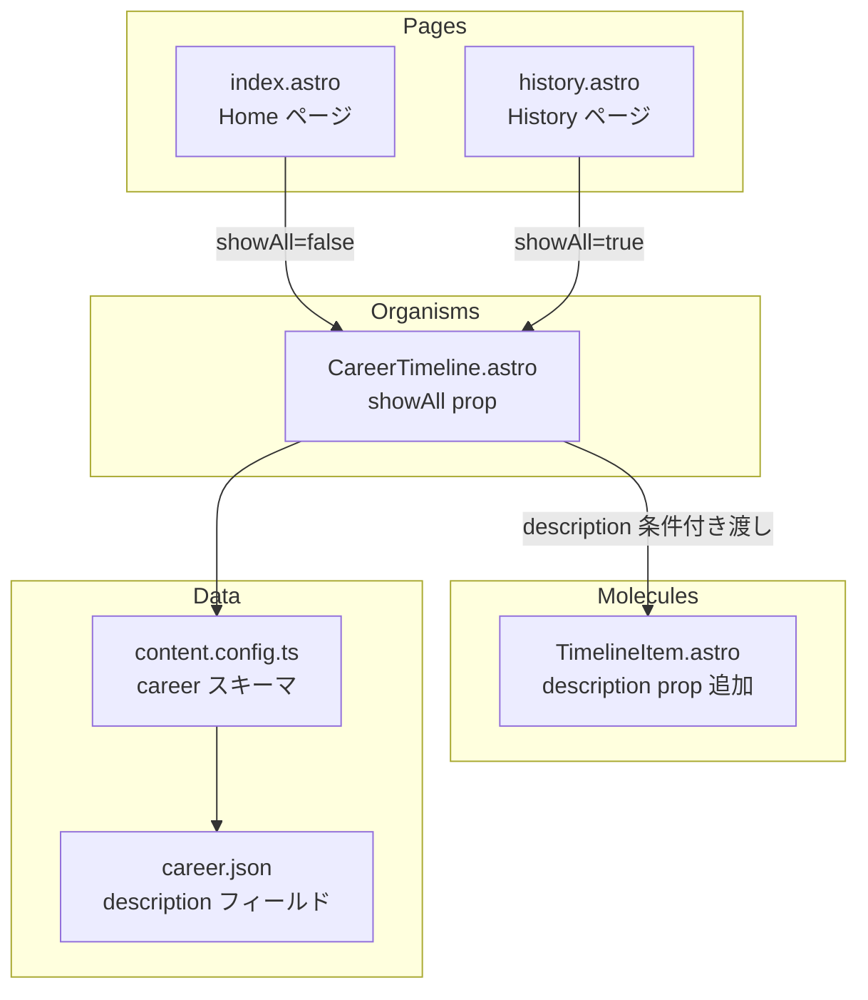
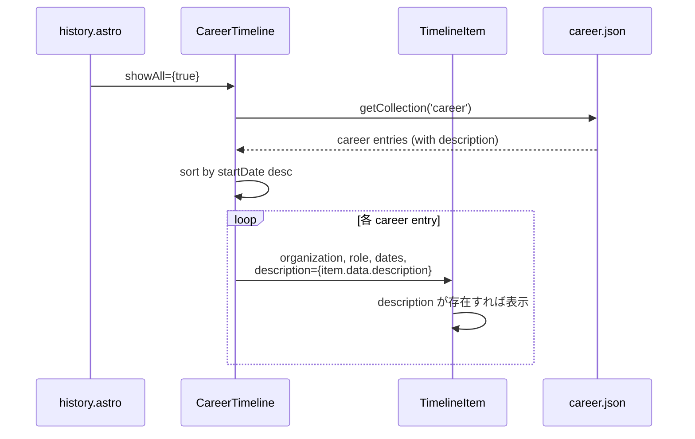
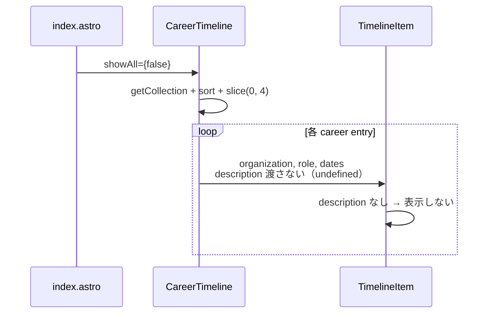

# Design Document: career-detail-history

## Overview

History ページ（`/history`）の経歴タイムラインに、各キャリアエントリの `description` フィールドを表示する機能を追加する。Home ページ（`/`）のタイムラインは現状のまま description を表示しない。これにより、History ページでは各経歴の詳細な活動内容を閲覧でき、Home ページではコンパクトな表示を維持する。

対象の GitHub Issue: #27「Bio の変更」

変更は最小限で、既存の Content Collections スキーマ（`description: z.string().nullable().optional()`）をそのまま活用し、データ追加とコンポーネントの条件付き表示ロジックのみを実装する。

また、既存のタイムライン縦線がモバイル表示時にコンテンツの高さに追従しない問題も合わせて修正する。

## Architecture



## Sequence Diagrams

### History ページでの description 表示フロー



### Home ページでの表示フロー（変更なし）



## Components and Interfaces

### Component 1: TimelineItem.astro（変更対象）

**目的**: 経歴タイムラインの個別エントリを表示する molecule コンポーネント

**Interface（変更後）**:
```typescript
export interface Props {
  organization: string;
  role: string;
  startDate: string;       // "YYYY-MM"
  endDate: string | null;
  description?: string | null;  // 追加: 経歴の詳細説明
  isLast?: boolean;
}
```

**責務**:
- 日付のフォーマット（`YYYY-MM` → `YYYY 年 M 月`）
- 組織名・役割の表示
- description が truthy な場合のみ説明テキストを表示
- タイムラインのドット・ラインの描画

**タイムライン縦線の修正**:

現状の実装では、タイムラインの左カラム（ドット + 縦線）が `flex flex-col` + `flex-1` で高さを確保しているが、モバイルでコンテンツが折り返すと縦線がコンテンツの高さに追従しない。

修正方針: 縦線を `flex-1` ではなく `absolute` 配置に変更し、親要素の高さに確実に追従させる。

```astro
<!-- Before: flex-1 で高さ確保（モバイルで不足する場合あり） -->
<div class="flex flex-col items-center">
  <div class="w-3 h-3 rounded-full shrink-0 mt-1" style="background: var(--color-primary);" />
  {!isLast && (
    <div class="w-px flex-1 mt-1" style="background: var(--color-border);"></div>
  )}
</div>

<!-- After: absolute 配置で親の高さに追従 -->
<div class="relative flex flex-col items-center">
  <div class="w-3 h-3 rounded-full shrink-0 mt-1 z-10" style="background: var(--color-primary);" />
  {!isLast && (
    <div class="absolute top-4 bottom-0 w-px" style="background: var(--color-border);"></div>
  )}
</div>
```

### Component 2: CareerTimeline.astro（変更対象）

**目的**: 経歴コレクションを取得・ソートし、TimelineItem を一覧表示する organism コンポーネント

**Interface（変更なし）**:
```typescript
export interface Props {
  /** true のとき全件表示、false のとき最新 4 件のみ */
  showAll?: boolean;
}
```

**責務**:
- `getCollection('career')` でデータ取得
- `startDate` 降順ソート
- `showAll` に応じた件数制御
- `showAll === true` の場合のみ `description` を TimelineItem に渡す
- `showAll === false` の場合は `description` を渡さない（Home ページの表示を変えない）

## Data Models

### career.json エントリ（変更対象）

```typescript
interface CareerEntry {
  id: string;
  organization: string;
  role: string;
  startDate: string;                    // "YYYY-MM"
  endDate: string | null;               // null = 現職
  description?: string | null;          // 経歴の詳細説明（optional）
}
```

**content.config.ts スキーマ（変更不要）**:
```typescript
const career = defineCollection({
  loader: file('./src/data/career/career.json'),
  schema: z.object({
    id: z.string(),
    organization: z.string(),
    role: z.string(),
    startDate: z.string(),
    endDate: z.string().nullable(),
    description: z.string().nullable().optional(),  // 既に定義済み
  }),
});
```

**追加データ**:

| id | description |
|---|---|
| `kyutech-undergrad` | Depth カメラとカラーマーカーを用いて、ドラムパーツを 3D 空間に自由配置できる仮想ドラムシステムを開発しました。 |
| `kyutech-master` | 学部で開発した仮想ドラムシステムに UKF（Unscented Kalman Filter）を導入し、予測モデルによるスティック軌跡の補間を実現しました。 |
| `aws` | （既存: 変更なし） |

**バリデーションルール**:
- `description` は optional かつ nullable（`z.string().nullable().optional()`）
- 存在する場合は空文字でない string
- 和欧混植ルール準拠（日本語と英数字の間に半角スペース）

## Key Functions with Formal Specifications

### Function 1: TimelineItem description 表示ロジック

```typescript
// TimelineItem.astro frontmatter
const { organization, role, startDate, endDate, description, isLast = false } = Astro.props;
```

**Preconditions:**
- `organization` は非空文字列
- `startDate` は `YYYY-MM` 形式
- `description` は `string | null | undefined`

**Postconditions:**
- `description` が truthy（非 null、非 undefined、非空文字列）の場合のみ `<p>` 要素を出力
- `description` が falsy の場合、DOM に description 関連の要素は一切出力されない
- 既存の organization / role / date 表示に影響しない

### Function 2: CareerTimeline description 条件付き渡し

```typescript
// CareerTimeline.astro 内の TimelineItem 呼び出し
<TimelineItem
  organization={item.data.organization}
  role={item.data.role}
  startDate={item.data.startDate}
  endDate={item.data.endDate ?? null}
  description={showAll ? item.data.description : undefined}
  isLast={i === items.length - 1}
/>
```

**Preconditions:**
- `showAll` は boolean
- `item.data.description` は `string | null | undefined`

**Postconditions:**
- `showAll === true` → `description` に `item.data.description` の値をそのまま渡す
- `showAll === false` → `description` に `undefined` を渡す（TimelineItem 側で非表示）
- 既存の props（organization, role, startDate, endDate, isLast）に影響しない

## Example Usage

### History ページ（description 表示あり）

```typescript
// history.astro
<CareerTimeline showAll={true} />

// → CareerTimeline が description を TimelineItem に渡す
// → TimelineItem が description を表示する
```

### Home ページ（description 表示なし、変更なし）

```typescript
// index.astro
<CareerTimeline showAll={false} />

// → CareerTimeline が description を渡さない
// → TimelineItem は description を表示しない
```

### レスポンシブレイアウト（CSS Grid ベース）

**設計方針**: 左カラム（organization + role）の幅を固定比率（50%）ではなく、全エントリの最大コンテンツ幅に自動で揃える。これにより description がないエントリでも不自然な空白が生じない。

**実現方法**: CareerTimeline（親）側で CSS Grid を定義し、TimelineItem は各行のセルとして配置する。

**モバイル（デフォルト）**: 縦積み（organization → role → description）。Grid は適用しない。

**PC（`md:` 以上）**: CareerTimeline 側で 3 カラム Grid を定義。

```
grid-template-columns: auto 1px 1fr
                       ^^^^  ^^^  ^^^
                       左     線   右（description）
```

- 左カラム（`auto`）: 全エントリの最大コンテンツ幅に自動で揃う
- セパレーター（`1px`）: 縦の境界線（`var(--color-border)`）。独立した grid セルとして描画
- 右カラム（`1fr`）: 残りの幅を description が使用

**CareerTimeline 側の Grid コンテナ**:

```astro
<!-- showAll 時のみ Grid レイアウトを適用 -->
<div class={showAll ? "md:grid md:gap-y-0" : ""} style={showAll ? "grid-template-columns: auto 1px 1fr;" : ""}>
  {items.map((item, i) => (
    <TimelineItem
      organization={item.data.organization}
      role={item.data.role}
      startDate={item.data.startDate}
      endDate={item.data.endDate ?? null}
      description={showAll ? item.data.description : undefined}
      isLast={i === items.length - 1}
    />
  ))}
</div>
```

**TimelineItem 側の出力**:

description あり（`showAll=true`、Grid 内）の場合、TimelineItem は 3 つの grid セルを出力する:

```astro
<!-- セル 1: 左カラム（タイムラインドット + org + role） -->
<div class="md:pr-4">
  <!-- タイムラインドット + 日付 + org + role -->
</div>

<!-- セル 2: セパレーター -->
<div class="hidden md:block" style="background: var(--color-border);"></div>

<!-- セル 3: 右カラム（description） -->
<div class="md:pl-4">
  {description && <p>...</p>}
</div>
```

description なし（`showAll=false`、Grid 外）の場合、TimelineItem は従来通りの flex レイアウトで出力する。

**注意**: `showAll=false` のとき CareerTimeline は Grid コンテナを適用しないため、TimelineItem のセパレーター・右カラムのセルは出力されても `hidden` で非表示となり、Home ページの表示に影響しない。

## Correctness Properties

*A property is a characteristic or behavior that should hold true across all valid executions of a system-essentially, a formal statement about what the system should do. Properties serve as the bridge between human-readable specifications and machine-verifiable correctness guarantees.*

### Property 1: showAll による description 渡し制御

*For any* career_entry と任意の showAll 値に対して、`showAll === true` のとき description が TimelineItem に渡され、`showAll === false` のとき `undefined` が渡される。

**Validates: Requirements 1.1, 2.1**

### Property 2: description の条件付き表示

*For any* TimelineItem に渡される description 値に対して、truthy（非 null、非 undefined、非空文字列）なら description テキストを含む DOM 要素が出力され、falsy なら description 関連の DOM 要素は一切出力されない。

**Validates: Requirements 1.2, 1.3**

### Property 3: career スキーマバリデーション

*For any* career_entry の description フィールドに対して、`string | null | undefined` 型ならスキーマバリデーションを通過し、それ以外の型ならバリデーションエラーが発生する。

**Validates: Requirements 5.1, 5.4**

### Property 4: 日付フォーマットの不変性

*For any* `YYYY-MM` 形式の文字列に対して、formatDate 関数は `YYYY 年 M 月` 形式の文字列を返し、description 機能追加の前後で結果が変わらない。

**Validates: Requirement 6.2**

### Property 5: ソート順の不変性

*For any* career_entry のリストに対して、startDate 降順ソートの結果は description フィールドの有無に影響されない。

**Validates: Requirement 6.3**

## Error Handling

### Scenario 1: description が null または undefined

**条件**: career.json のエントリに description フィールドがない、または null
**対応**: TimelineItem の条件付きレンダリング（`{description && ...}`）により、要素を出力しない
**影響**: なし。既存の表示と同一

### Scenario 2: description が空文字列

**条件**: `"description": ""`
**対応**: JavaScript の falsy 評価により空文字列は表示されない
**影響**: なし

### Scenario 3: content.config.ts スキーマ不一致

**条件**: career.json に不正な型の description が含まれる
**対応**: Astro ビルド時に Zod バリデーションエラーが発生し、ビルド失敗
**復旧**: career.json のデータを修正

## Testing Strategy

### Unit Testing Approach

この変更は Astro コンポーネント（`.astro` ファイル）のみに影響するため、Vitest での直接的なユニットテストは対象外。代わりに以下で検証する:

1. **ビルド検証**: `npm run build` が成功すること
2. **スキーマ検証**: career.json が content.config.ts のスキーマに適合すること

### Integration Testing Approach

1. **目視確認**: History ページで description が表示されること
2. **目視確認**: Home ページで description が表示されないこと
3. **レスポンシブ確認**: モバイル・デスクトップ両方で description のレイアウトが崩れないこと

## Performance Considerations

- description は静的テキストのみ（画像・リンクなし）のため、パフォーマンスへの影響は無視できる
- SSG ビルド時に HTML に埋め込まれるため、ランタイムコストなし

## Security Considerations

- description は career.json からの静的データであり、ユーザー入力ではないため XSS リスクなし
- Astro のテンプレートはデフォルトで HTML エスケープを行う

## Dependencies

- 新規依存パッケージなし
- 既存の Astro Content Collections + Zod スキーマをそのまま活用
