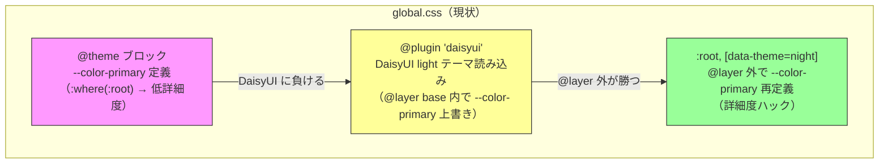
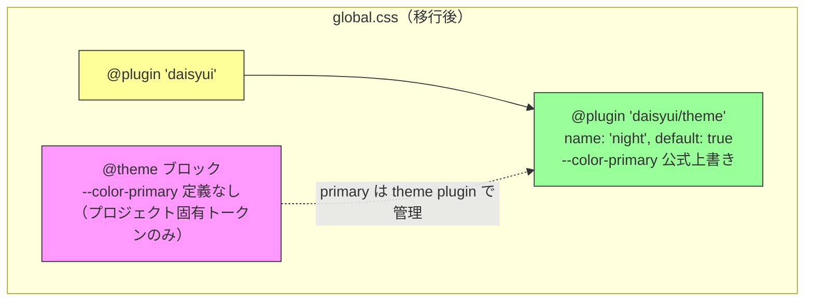
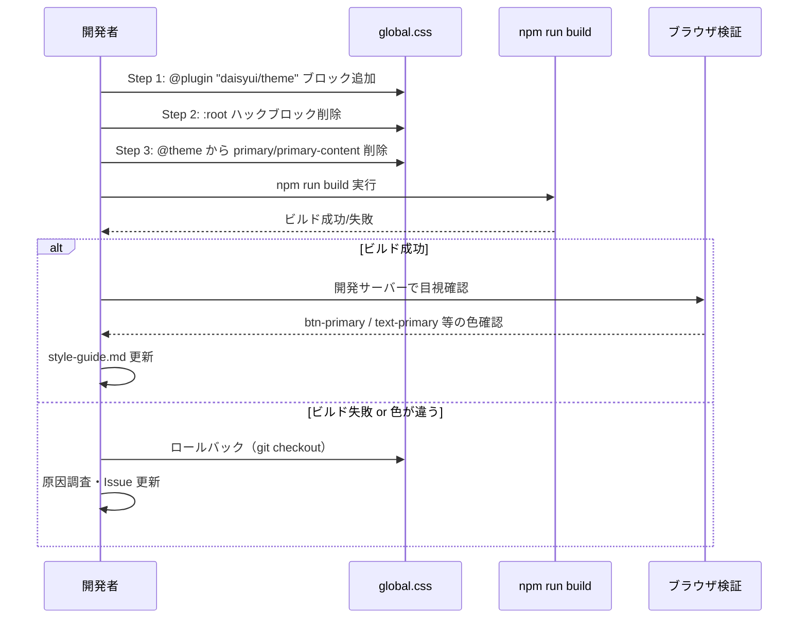

# 設計ドキュメント: DaisyUI テーマカラー上書き方式の移行

## 概要

DaisyUI v5 の primary カラー上書きを、現在の `:root` 詳細度ハック方式から公式 `@plugin "daisyui/theme"` 方式に移行するリファクタリング。

現状、`src/styles/global.css` では `@theme` ブロックと `@layer` 外の `:root, [data-theme=light]` ブロックの 2 箇所で `--color-primary` / `--color-primary-content` を重複定義している。この重複は値の同期漏れリスクと DaisyUI 内部実装への依存を生んでいる。

サイトは暗い背景（`--color-bg: oklch(0.10 0.04 195)`）で運用されているため、DaisyUI のベーステーマとして `night`（ダーク系）を採用し、その上で primary カラーをカスタマイズする。

ただし、プロジェクトの `style-guide.md` ステアリングルールでは `@plugin "daisyui/theme"` は「効果がない方法」として明記されている。このため、移行の前提として DaisyUI v5.5.19 + Tailwind CSS v4.2.0 環境での動作検証が必須であり、検証結果に基づいてステアリングルールの更新も行う。

## アーキテクチャ

### 現状の構成



### 移行後の構成



## シーケンス図

### 移行作業フロー



## コンポーネントとインターフェース

### 対象ファイル

| ファイル | 変更内容 |
|---|---|
| `src/styles/global.css` | CSS 構造の変更（メイン対象） |
| `.kiro/steering/style-guide.md` | DaisyUI テーマカラー上書き規約の更新 |

### 影響を受けるコンポーネント（変更不要だが検証対象）

DaisyUI の `primary` カラーを使用しているコンポーネント:

| コンポーネント | 使用箇所 |
|---|---|
| `btn-primary` を使う全コンポーネント | ボタン背景色 |
| `badge-primary` を使う全コンポーネント | バッジ背景色 |
| `text-primary` を使う全コンポーネント | テキスト色 |
| `bg-primary` を使う全コンポーネント | 背景色 |
| `var(--color-primary)` を参照する全コンポーネント | カスタムプロパティ経由 |


## データモデル

### CSS 変数の管理場所（移行前後の比較）

| CSS 変数 | 移行前の定義場所 | 移行後の定義場所 |
|---|---|---|
| `--color-primary` | `@theme` + `:root` ハック（2 箇所重複） | `@plugin "daisyui/theme"` のみ |
| `--color-primary-content` | `@theme` + `:root` ハック（2 箇所重複） | `@plugin "daisyui/theme"` のみ |
| `--color-bg` | `@theme` | `@theme`（変更なし） |
| `--color-text` | `@theme` | `@theme`（変更なし） |
| その他 `--color-*` | `@theme` | `@theme`（変更なし） |

### 検証ルール

- `--color-primary` の計算値が `oklch(0.55 0.15 145)` であること
- `--color-primary-content` の計算値が `oklch(0.98 0.005 145)` であること
- DaisyUI コンポーネント（`btn-primary` 等）にカスタム primary が適用されること
- Tailwind ユーティリティ（`text-primary`, `bg-primary` 等）が正しく動作すること

## アルゴリズム的擬似コード

### global.css 移行手順

```pascal
ALGORITHM migrateThemeOverride
INPUT: global.css（現在の内容）
OUTPUT: global.css（移行後の内容）

BEGIN
  // Step 1: @plugin "daisyui" の直後に @plugin "daisyui/theme" を追加
  LOCATE line: @plugin "daisyui";
  INSERT AFTER:
    @plugin "daisyui/theme" {
      name: "night";
      default: true;
      --color-primary: oklch(0.55 0.15 145);
      --color-primary-content: oklch(0.98 0.005 145);
    }

  // Step 2: @theme ブロックから primary 関連を削除
  LOCATE in @theme block:
    --color-primary: oklch(0.55 0.15 145);
    --color-primary-content: oklch(0.98 0.005 145);
  REMOVE these two lines

  // Step 3: :root ハックブロックを削除
  LOCATE block:
    :root, [data-theme=night] {
      --color-primary: oklch(0.55 0.15 145);
      --color-primary-content: oklch(0.98 0.005 145);
    }
  REMOVE entire block (including preceding comment)

END
```

**事前条件:**
- DaisyUI v5.5.19 以上がインストールされていること
- Tailwind CSS v4.2.0 以上がインストールされていること
- `@plugin "daisyui/theme"` が DaisyUI v5 で正式サポートされていること

**事後条件:**
- `--color-primary` の値が移行前と同一であること
- `--color-primary-content` の値が移行前と同一であること
- `@theme` ブロックに primary 関連の重複定義がないこと
- `@layer` 外の `:root` ハックが存在しないこと

## 主要関数と形式仕様

### 移行後の global.css 構造

```css
/* Google Fonts */
@import url('https://fonts.googleapis.com/css2?family=Noto+Sans+JP:wght@400;500;700&family=Inter:wght@400;500;600;700&family=JetBrains+Mono:wght@400;500&display=swap');

@import "tailwindcss";
@plugin "daisyui";
@plugin "daisyui/theme" {
  name: "night";
  default: true;
  --color-primary: oklch(0.55 0.15 145);
  --color-primary-content: oklch(0.98 0.005 145);
}
@source "../**/*.{astro,ts,tsx}";

@theme {
  /* フォント */
  --font-sans: 'Inter', 'Noto Sans JP', ui-sans-serif, system-ui, sans-serif;
  --font-mono: 'JetBrains Mono', ui-monospace, monospace;

  /* OKLCHカラーパレット（プロジェクト固有トークン） */
  /* NOTE: --color-primary と --color-primary-content は
     @plugin "daisyui/theme" で管理するためここには定義しない */
  --color-bg:        oklch(0.10 0.04 195);
  --color-text:      oklch(0.20 0.010 250);
  --color-text-muted: oklch(0.45 0.010 250);
  --color-secondary: oklch(0.60 0.08 150);
  --color-border:    oklch(0.88 0.008 150);
  --color-shadow:    oklch(0.70 0.010 150 / 0.15);

  /* 追加トークン */
  --color-surface:          oklch(0.96 0.006 120);
  --color-surface-hover:    oklch(0.92 0.008 145);
  --color-surface-subtle:   oklch(0.92 0.006 120);
  --color-text-body:        oklch(0.35 0.010 250);
  --color-text-strong:      oklch(0.25 0.010 250);
  --color-text-secondary:   oklch(0.60 0.010 250);
  --color-header-bg:        oklch(0.98 0.005 120 / 0.85);
  --color-nav-active-bg:    oklch(0.92 0.010 145);
  --color-nav-active-text:  oklch(0.40 0.15 145);
  --color-shadow-sm:        oklch(0.70 0.010 150 / 0.10);
  --color-shadow-md:        oklch(0.70 0.010 150 / 0.20);
}

@layer base {
  html {
    font-family: var(--font-sans);
    background-color: var(--color-bg);
    color: var(--color-text);
    scroll-behavior: smooth;
  }

  body {
    min-height: 100dvh;
    background-color: var(--color-bg);
    color: var(--color-text);
  }

  p {
    margin: 0;
  }
}
```

**事前条件:**
- `@plugin "daisyui"` が `@plugin "daisyui/theme"` より前に宣言されていること
- `@plugin "daisyui/theme"` の `name` が `"night"` であること（ダーク系ベーステーマ）
- `default: true` が指定されていること

**事後条件:**
- `:root` ハックブロックが存在しないこと
- `@theme` ブロックに `--color-primary` / `--color-primary-content` が存在しないこと
- `@plugin "daisyui/theme"` ブロックに正しい値が設定されていること

## 使用例

### 検証用コマンド

```bash
# ビルド検証
npm run build

# 開発サーバーで目視確認（手動実行）
npm run dev
```

### ブラウザ DevTools での検証手順

```javascript
// 1. btn-primary 要素の computed style を確認
const btn = document.querySelector('.btn-primary');
const style = getComputedStyle(btn);
console.log('background-color:', style.backgroundColor);
// 期待値: oklch(0.55 0.15 145) 相当の値

// 2. text-primary 要素の computed style を確認
const text = document.querySelector('.text-primary');
const textStyle = getComputedStyle(text);
console.log('color:', textStyle.color);
// 期待値: oklch(0.55 0.15 145) 相当の値

// 3. CSS 変数の値を直接確認
const root = document.documentElement;
const rootStyle = getComputedStyle(root);
console.log('--color-primary:', rootStyle.getPropertyValue('--color-primary'));
// 期待値: oklch(0.55 0.15 145)
```

## 正当性プロパティ

*プロパティとは、システムの全ての有効な実行において成立すべき特性や振る舞いのことである。プロパティは人間が読める仕様と機械的に検証可能な正当性保証の橋渡しとなる。*

### Property 1: Plugin 宣言順序の正当性

*任意の* 有効な移行後 Global_CSS に対して、`@plugin "daisyui"` の宣言位置は `@plugin "daisyui/theme"` の宣言位置より前であること

**Validates: Requirement 1.1**

### Property 2: Root_Hack の不在

*任意の* 移行後 Global_CSS に対して、`@layer` 外に `:root` または `[data-theme=...]` セレクタで `--color-primary` を定義するブロックが存在しないこと

**Validates: Requirements 2.1**

### Property 3: 移行対象変数の単一定義

*任意の* 移行対象 CSS 変数（`--color-primary`, `--color-primary-content`）に対して、移行後 Global_CSS 内での定義箇所は `@plugin "daisyui/theme"` ブロック内の 1 箇所のみであること

**Validates: Requirements 2.2, 2.3, 2.4, 2.5**

### Property 4: 非移行対象プロパティの不変性

*任意の* 移行対象でないカスタムプロパティ（`--color-bg`, `--color-text`, `--color-secondary` 等）に対して、`@theme` ブロック内の定義値は移行前後で同一であること

**Validates: Requirement 3.5**

## エラーハンドリング

### エラーシナリオ 1: `@plugin "daisyui/theme"` が動作しない

**条件**: DaisyUI v5 の当該バージョンで `@plugin "daisyui/theme"` がカラー上書きをサポートしていない場合
**対応**: ロールバック（`git checkout -- src/styles/global.css`）
**回復**: Issue #28 にコメントし、DaisyUI のバージョンアップを待つか、現行方式を維持する

### エラーシナリオ 2: ビルドエラー

**条件**: `@plugin "daisyui/theme"` の構文が不正、または DaisyUI が認識しない場合
**対応**: ビルドログのエラーメッセージを確認し、構文を修正。修正不可の場合はロールバック
**回復**: DaisyUI 公式ドキュメントで正しい構文を確認

### エラーシナリオ 3: カラーが適用されない（DaisyUI デフォルトのまま）

**条件**: `@plugin "daisyui/theme"` は構文エラーにならないが、カラー上書きが効かない場合
**対応**: DevTools で `--color-primary` の値と適用元を確認。`:root` ハック方式に戻す
**回復**: DaisyUI の Issue tracker で同様の報告を検索

## テスト戦略

### 検証フェーズ 1: カタログでの段階的検証

`data-theme` 属性を使い、カタログページ（`catalog.astro`）で Before/After を並べて安全に検証する。

1. `global.css` に `@plugin "daisyui/theme"` ブロックを追加（`:root` ハックは残したまま共存させる）
2. `npm run build` でビルドエラーがないことを確認
3. `catalog.astro` に検証用セクションを追加:

```html
<!-- Before: light テーマ（DaisyUI デフォルト + :root ハック経由） -->
<div data-theme="light">
  <p>Before (light theme)</p>
  <button class="btn btn-primary">Primary Button</button>
  <span class="badge badge-primary">Badge</span>
  <span class="text-primary">Text Primary</span>
</div>

<!-- After: night テーマ + @plugin "daisyui/theme" 経由のカスタム primary -->
<div data-theme="night">
  <p>After (night + custom primary)</p>
  <button class="btn btn-primary">Primary Button</button>
  <span class="badge badge-primary">Badge</span>
  <span class="text-primary">Text Primary</span>
</div>
```

4. 開発サーバー（`npm run dev`）でカタログページを開き、Before/After を目視比較
5. `data-theme="night"` セクション内で `--color-primary` がカスタム値（`oklch(0.55 0.15 145)`）になっていることを DevTools で確認
6. DevTools で `--color-primary` の適用元が `@plugin "daisyui/theme"` 経由（`:root` ハックではなく）であることを確認

### 検証フェーズ 2: 全体適用

カタログでの検証が OK であることをユーザーが確認した後:

1. `:root` ハックブロックを削除
2. `@theme` ブロックから `--color-primary` / `--color-primary-content` を削除
3. `npm run build` 成功を確認
4. 開発サーバーで全ページを目視確認（カタログ以外のページでも問題ないこと）

### 検証フェーズ 3: クリーンアップとステアリングルール更新

1. `catalog.astro` から検証用 Before/After セクションを削除
2. `.kiro/steering/style-guide.md` の「DaisyUI テーマカラーの上書き規約」セクションを更新
3. `@plugin "daisyui/theme"` を「正しい方法」として記載
4. `:root` ハック方式を「レガシー方式」として記載

### プロパティベーステスト

CSS の変更はランタイムテストが困難なため、ビルド成功とカタログでの目視確認を主な検証手段とする。

## セキュリティ考慮事項

本リファクタリングはスタイルシートの内部構造変更のみであり、セキュリティへの影響はない。

## ロールバック計画

移行が失敗した場合の復旧手順:

```bash
# global.css を移行前の状態に戻す
git checkout -- src/styles/global.css

# ビルド確認
npm run build
```

ロールバック後、Issue #28 に検証結果をコメントし、以下のいずれかを判断する:
- DaisyUI のバージョンアップ後に再挑戦
- 現行の `:root` ハック方式を正式な方式として維持

## 依存関係

| パッケージ | 現在のバージョン | 必要条件 |
|---|---|---|
| `daisyui` | `^5.5.19` | `@plugin "daisyui/theme"` をサポートしていること |
| `tailwindcss` | `^4.2.0` | Tailwind CSS v4 の `@plugin` 構文をサポートしていること |
| `@tailwindcss/vite` | `^4.2.0` | Vite 経由の Tailwind CSS v4 ビルドが正常に動作すること |

## ステアリングルール矛盾の解決方針

### 現状の矛盾

`style-guide.md` では `@plugin "daisyui/theme"` を「効果がない方法」として明記しているが、Issue #28 ではこの方式への移行を提案している。

### 解決アプローチ

1. **検証ファースト**: まず `@plugin "daisyui/theme"` が実際に動作するかを検証する
2. **結果に基づく判断**:
   - 動作する場合 → `style-guide.md` を更新し、`@plugin "daisyui/theme"` を正しい方法として記載
   - 動作しない場合 → Issue #28 を close し、現行方式を維持。`style-guide.md` は変更しない
3. **ステアリングルール更新**: 移行成功時のみ `style-guide.md` の該当セクションを書き換える
